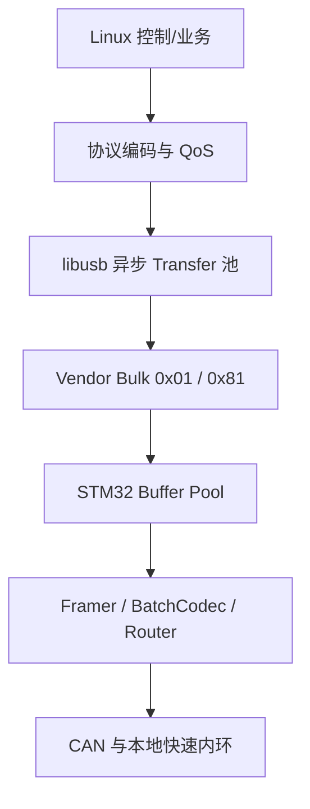

# USB 全景掌握：从总线第一性原理到 STM32、Linux 与 RMCS

> 面向机器人控制与嵌入式开发的教材式教程  
> 主线工程：STM32Cube USB Device + Vendor-specific Bulk + Linux `libusb`  
> 目标接口：EP0 Control、`0x01` Bulk OUT、`0x81` Bulk IN  
> 修订日期：2026-08-04

---

## 写在前面：这本书怎样讲 USB

学习 USB 最容易掉进两个坑。第一个坑是照着 CubeMX 点几下，记住 `CDC_Transmit_FS()`，程序似乎能传数据，却不知道数据为什么有时只到 64 字节、为什么第一包成功后就卡住、为什么一次 `Transmit` 返回成功并不等于电脑已经收到。第二个坑是反过来背诵一大堆术语：Endpoint、Pipe、Transaction、Transfer、Frame、URB……每个词都认识，但它们没有连接成一条能够指导代码设计的因果链。

本书不采用这两种方式。我们从一个最朴素的问题开始：一台电脑怎样可靠地控制一块 STM32 板卡？为了回答它，先推导 USB 为什么必须由 Host 主导，为什么 Device 要先描述自己，为什么线上一次交换需要 Token、DATA 和 Handshake，为什么软件的一次 I/O 又会被拆成多个交换。到这里，Packet、Transaction、Transfer 和 Frame 才会自然出现，而不是作为需要死记的名词表出现。

随后我们把同一条链路落到真实代码：STM32 端给出一个可以放进经典 STM32Cube USB Device 工程的 Vendor Bulk 类；Linux 端给出可编译的 `libusb` Loopback 程序；再从同步程序推进到异步 Transfer 池、Buffer 所有权、取消和重连。最后才把这些机制接入 RMCS：如何定义消息边界、序号、时间戳、ACK、流控、QoS，以及为什么快速控制内环仍应留在 MCU。

全书始终区分三种陈述：

1. **USB 规范事实**，例如 Full-Speed Bulk 的最大 DATA Payload 是 64 B；
2. **某个软件栈的实现事实**，例如经典 STM32Cube Class Driver 通过 `DataOut` 回调重新 Arm OUT Endpoint；
3. **本项目的设计选择**，例如 RMCS 第一版使用 Vendor Bulk，而不是 Isochronous。

这三类东西如果混在一起，就会把“当前代码恰好这样写”误认为“USB 必须如此”，或者把“USB 能做到”误认为“当前软件栈已经替你做好”。

### 本书的具体边界

设备端示例假设使用 ST 经典 USB Device Middleware、单一 Configuration、单一 Vendor Interface、Full-Speed Device 模式和非 Composite 构建器。不同 STM32 系列的 USB 外设可能使用 PMA、FIFO、内部 FS PHY 或外部 ULPI PHY，因此 `usbd_conf.c`、中断名、时钟、引脚和 Cache 维护必须以目标芯片的 Reference Manual、Datasheet 与 Cube 版本为准。协议层和 Host 端代码则不绑定某一颗 STM32。

本书不会声称一段不带工程上下文的代码能覆盖所有 STM32Cube 版本。凡是完整列出的文件，都给出其依赖和接入位置；凡是只讲机制的片段，会明确标为片段，不把未定义函数伪装成“完整实现”。

### 全书导航

第一篇从 Host 主导原则出发，推导物理层、枚举、Packet—Transaction—Transfer—Message 和 Frame 调度；第二篇用资源承诺解释四类 Transfer 与控制延迟；第三篇进入 STM32Cube，给出完整 Vendor Bulk Device；第四篇从同步 libusb 测试推进到异步 Transfer 池与重连；第五篇把字节 Transport 接入可测试的 Framer 和 RMCS 控制语义。

| 篇 | 章节 | 最终要解决的问题 |
|---|---|---|
| 第一篇 | 1～6 | 一段应用数据在线缆上究竟怎样发生 |
| 第二篇 | 7～8 | Bulk/Interrupt/Isochronous 分别承诺什么，控制系统怎样选 |
| 第三篇 | 9～11 | STM32 怎样正确管理 Endpoint、Rearm、Busy 与 Buffer |
| 第四篇 | 12～15 | Linux 怎样保持异步 I/O、取消、断线和跨平台生命周期 |
| 第五篇 | 16～18 | RMCS 怎样定义消息、时序、可靠性、流控、QoS 和验证 |

---

# 第一篇　先建立一条完整的数据因果链

## 第 1 章　USB 为什么不是“更快的串口”

### 1.1 从系统要解决的问题出发

UART 的基本模型很简单：两端约定波特率，一端把比特发出去，另一端按相同节奏接收。它不负责告诉操作系统“我是什么设备”，也没有统一的端点、驱动类别、热插拔和带宽调度模型。CAN 比 UART 更进一步，多节点能够竞争同一条总线，仲裁 ID 决定谁先发送，但每个节点依然可以在总线空闲时主动发起通信。

USB 面对的是另一类问题。一台电脑可能同时连接键盘、摄像头、硬盘、音频设备和多块控制板。若每个设备都可以自行占用总线，Host 很难统一安排周期带宽、供电、热插拔和错误恢复。因此 USB 选择了一个非常强的基本约束：

> **总线上的每一次有意义交换都由 Host 发起。**

这句话是后续所有机制的根。Host 想把数据交给设备，就发起 OUT；Host 想从设备取数据，就发起 IN。方向永远站在 Host 一侧命名：

```text
OUT：Host → Device
 IN：Device → Host，但仍由 Host 先发 IN Token 来索取
```

于是 STM32 所谓“主动上报”并不是像 CAN 节点那样抢占总线。STM32 真正能做的是先把数据放进 IN Endpoint 的缓冲区，等待 Host 发出 IN Token；只有到那一刻，USB 外设才把准备好的 DATA Packet 放到线上。如果 Host 没有提交 IN 请求，设备端的数据就只能留在 FIFO 或内存中。

这也解释了为什么 Linux 主机端必须长期保持 IN Transfer 在途。等待设备“通知我有数据后再读”会形成逻辑循环：设备要通知 Host，本身也需要 Host 已经给了它一次 IN 机会。

### 1.2 Host、Device、Hub 与 Endpoint 怎样组成系统

USB 物理拓扑是分层星形。Host Root Hub 向下接 Device 或外部 Hub，Hub 再扩展更多点对点下行链路。Hub 负责端口连接检测、复位、供电控制和流量转发，但整棵树仍由同一个 Host 调度。

一块 STM32 板卡是一个 USB Device。一个 Device 可以提供一个或多个功能接口，例如 Vendor 数据接口、DFU 升级接口和 HID 状态接口。每个接口通过 Endpoint 搬运数据。

Endpoint 不是线上的插孔，而是设备控制器内部的单向逻辑通道。它至少具有四个属性：编号、方向、传输类型和最大 Packet 大小。端点地址的 bit7 表示方向，因此：

```text
0x01 = Endpoint 1 OUT，Host 向 STM32 写
0x81 = Endpoint 1 IN， STM32 被 Host 读取
```

虽然编号都为 1，`0x01` 与 `0x81` 仍是两个不同方向的 Endpoint 地址。Host 软件围绕目标 Device 的某个 Endpoint 建立通信关系，这个 Host 侧抽象叫 Pipe。初学阶段不必把 Pipe 想得神秘：Endpoint 是设备提供的门，Pipe 是 Host 通向这扇门的路径。

### 1.3 为什么 Endpoint 0 必须特殊

Host 刚检测到设备时还不知道它是谁，也不知道它有哪些 Endpoint。双方必须先有一个无需预先协商就存在的管理入口，因此每个 USB Device 都必须提供 Endpoint 0，简称 EP0。EP0 是双向 Control Endpoint，用于读取描述符、分配地址、选择 Configuration 和处理标准请求。

业务数据最后即使全部走 `0x01/0x81` Bulk，枚举仍然离不开 EP0。可以把完整过程理解为：EP0 先完成“认识设备和建立通信合同”，其他 Endpoint 再按照合同搬运业务数据。

### 1.4 USB 的五层不是五套互不相干的名词

为了定位问题，可以把系统分成五层，但层与层之间必须沿同一条数据链连接起来：

| 层级 | 此层真正解决的问题 | 本项目中的对象 |
|---|---|---|
| 物理层 | 比特怎样跨过线缆，设备怎样被检测 | D+/D−、PHY、VBUS、Type-C CC |
| 总线协议层 | 谁先说、数据给谁、成功与否怎样确认 | Packet、Transaction、SOF、CRC、ACK/NAK |
| 设备模型层 | Device 怎样声明自己的结构和能力 | Descriptor、Configuration、Interface、Endpoint |
| 软件传输层 | 操作系统与协议栈怎样提交一段 I/O | STM32 USB Stack、URB、`libusb_transfer` |
| 应用协议层 | 这段字节在机器人系统中表示什么 | RMCS Frame、Batch、Field、seq、deadline |

例如“64 B”属于 Endpoint 与总线协议层：它表示 Full-Speed Bulk 的一个 DATA Packet 最多携带 64 B有效载荷。它不是 RMCS 消息的长度上限。又例如 USB Handshake 中的 ACK 只确认一次链路交换成功；RMCS 的“Applied ACK”则表示执行器已经应用某条命令。两个 ACK 名字相同，所在层级和承诺完全不同。

---

## 第 2 章　比特怎样跨过线缆：速度、PHY、连接器与硬件

### 2.1 12 Mbit/s 到底表示什么

USB Full-Speed 的原始信号速率是：

\[
12\ \mathrm{Mbit/s}=1.5\ \mathrm{MB/s}
\]

这里的 `bit` 和 `byte` 不能混用。更重要的是，1.5 MB/s 仍不是应用可用吞吐，因为线缆上除了 Payload 还有同步字段、PID、地址、Endpoint 编号、CRC、握手、包间间隔和位填充。Host 还要把时间分给其他 Endpoint 与 Device。因此有效吞吐一定低于原始线速，且取决于传输类型、Packet 大小、队列是否持续有数据以及 Host Controller 的调度。

Full-Speed D+/D− 使用差分状态传输。规范用 J、K、SE0 等状态描述线上电平；数据使用 NRZI 编码，并通过 bit stuffing 避免过长的无跳变序列。理解到这里就足以解释一个重要事实：Payload 每增加 1 B，并不是线缆上只增加恰好 8 个无开销比特。后续做吞吐预算时必须使用实测或完整协议开销，而不能用 `12 Mbit/s ÷ 8` 直接当结论。

### 2.2 设备怎样让 Host 知道“我插进来了”

传统 USB 2.0 Device 通过数据线上的上拉表示连接和速度。Full-Speed Device 在 D+ 一侧呈现上拉；Low-Speed 在 D− 一侧。许多 STM32 已把可控上拉集成进 USB 外设，软件启动 PCD 后才连接到总线；另一些器件或特殊设计可能需要外部元件。是否内置、阻值和连接方式必须查目标芯片资料，不能从另一颗 STM32 的原理图机械照抄。

Host 检测到连接后会执行 Bus Reset。Full-Speed Device 回到默认地址 0，再从 EP0 开始枚举。High-Speed capable Device 还会在复位阶段进行高速握手；“芯片外设名称里带 OTG HS”并不自动证明 PCB 最终工作在 480 Mbit/s，因为有些 STM32 的 HS Core 需要外接 ULPI PHY，未接 PHY 时只能使用内部 FS PHY。

### 2.3 Connector、Speed、Class 是三条互相独立的轴

Type-C、Micro-B、Type-A 描述的是连接器形状和引脚体系；Full-Speed、High-Speed 描述物理信号速率；CDC、HID、MSC、Vendor 描述 Host 应怎样理解设备功能。三者不能互相推出。

一个 Type-C 接口完全可以只接 USB 2.0 的 D+/D−、VBUS、GND 和 CC1/CC2，此时它仍可能只是 12 Mbit/s Full-Speed。反过来，一个 Micro-B 接口也可能支持 USB 2.0 High-Speed。Vendor Class 同样不会改变 PHY 速度：CDC 和 Vendor 若都跑在同一 Full-Speed Bulk Endpoint 上，线缆的 12 Mbit/s 与 64 B 最大 Bulk Payload完全一样，差异主要来自 Host 驱动路径、缓冲策略和应用 API。

### 2.4 面向 STM32 Device 的硬件推理顺序

设计硬件时不要从“网上常见 USB 原理图”开始，而要从信号和角色开始。先确认板卡是 Device/UFP，Host 是否给 VBUS，目标 MCU 使用哪个 USB IP、哪个 PHY、哪组引脚以及 USB 时钟从哪里来。然后才进入连接器和保护器件。

对只实现 USB 2.0 Device 的 Type-C 口，CC1 与 CC2 通常需要各自的 `Rd` 来声明 Sink/UFP 角色；D+ 与 D− 要连接到连接器两种翻转方向对应的 USB 2.0 引脚。高速差分线应短、成对、参考连续地平面、少过孔；ESD 器件的寄生电容要适合 USB 速率。自供电板卡还要防止向 VBUS 反灌。

软件可正常枚举并不表示硬件已经充分可靠。机器人上电机 PWM、DC/DC、长线缆和地电位变化会把边缘设计暴露出来。因此硬件验收至少应覆盖反复插拔、不同 Host/Hub、执行器上电、最大电流工况、ESD/EMI 风险和长时间运行，而不是只在桌面空载下传一包字符串。

---

## 第 3 章　枚举不是魔法：Host 怎样从“未知电气设备”得到两个 Bulk Endpoint

### 3.1 为什么必须先有 Descriptor

Host 检测到 D+ 上拉时只知道“某个 Full-Speed Device 连接了”，并不知道它是键盘、摄像头还是 RMCS 控制板。USB 的解决办法不是让 Host 猜，而是让 Device 通过标准格式的数据结构描述自己。这些数据结构叫 Descriptor，直译为描述符。

Descriptor 不是运行中的数据包格式，而是设备能力合同。Host 先在默认地址 0 上使用 EP0 读取 Device Descriptor 的前几个字节，得到 EP0 最大包长；再读取完整 Device Descriptor、分配新地址、读取 Configuration 树并选择一个 Configuration。只有 `SET_CONFIGURATION` 成功后，Vendor Class 的 `Init()` 才真正打开 `0x01/0x81`。

典型时序可以写成：

```text
检测连接 → Bus Reset → 地址 0
        → GET_DESCRIPTOR(Device 前段)
        → GET_DESCRIPTOR(Device 完整)
        → SET_ADDRESS
        → GET_DESCRIPTOR(Configuration 树)
        → Host 选择驱动/接口
        → SET_CONFIGURATION
        → Class Init 打开业务 Endpoint
```

这些步骤全部通过 EP0 的 Control Transfer 完成。所谓 Control Transfer 不是“一种小包”，而是由 Setup Stage、可选 Data Stage 和 Status Stage 构成的一次管理操作。Setup Packet 固定 8 B，其中 `bmRequestType` 指明方向、请求类别和接收对象；`bRequest` 指明具体请求；`wValue/wIndex/wLength` 携带参数和数据阶段长度。

### 3.2 Configuration、Interface 与 Endpoint 为什么分三层

Device 可能有多套整体工作配置，因此最外层是 Configuration；一个 Configuration 可以同时提供多个功能，因此里面是 Interface；每个 Interface 再声明所用 Endpoint。我们的最小设备只有一套配置和一个接口：

```text
Device
└── Configuration 1
    └── Interface 0, Alternate Setting 0, Vendor-specific
        ├── Endpoint 0x01, Bulk OUT, 64 B
        └── Endpoint 0x81, Bulk IN,  64 B
```

`Alternate Setting` 允许同一个 Interface 在运行时选择不同 Endpoint/带宽组合。最小 Vendor Bulk 不需要切换，所以只提供 Setting 0。

下面的 Configuration Descriptor 是完整 32 B 数组，不是伪代码。它可以作为经典 STM32Cube 自定义 Class 的 FS Configuration Descriptor；符号常量来自 ST Middleware 的 `usbd_def.h`：

```c
#include "usbd_def.h"

#define VENDOR_CFG_DESC_SIZE 32U

__ALIGN_BEGIN static uint8_t vendor_fs_cfg_desc[VENDOR_CFG_DESC_SIZE]
__ALIGN_END = {
    /* Configuration Descriptor, 9 B */
    0x09, USB_DESC_TYPE_CONFIGURATION,
    LOBYTE(VENDOR_CFG_DESC_SIZE), HIBYTE(VENDOR_CFG_DESC_SIZE),
    0x01,             /* bNumInterfaces */
    0x01,             /* bConfigurationValue */
    0x00,             /* iConfiguration */
    0x80,             /* Bus-powered, no remote wakeup */
    0x32,             /* 100 mA; unit is 2 mA */

    /* Interface Descriptor, 9 B */
    0x09, USB_DESC_TYPE_INTERFACE,
    0x00,             /* bInterfaceNumber */
    0x00,             /* bAlternateSetting */
    0x02,             /* bNumEndpoints */
    0xFF,             /* Vendor-specific class */
    0x00,             /* SubClass */
    0x00,             /* Protocol */
    0x00,             /* iInterface */

    /* Endpoint 1 OUT, 7 B */
    0x07, USB_DESC_TYPE_ENDPOINT,
    0x01,             /* bEndpointAddress */
    0x02,             /* bmAttributes: Bulk */
    0x40, 0x00,       /* wMaxPacketSize: 64 */
    0x00,             /* bInterval: ignored for Bulk */

    /* Endpoint 1 IN, 7 B */
    0x07, USB_DESC_TYPE_ENDPOINT,
    0x81,
    0x02,
    0x40, 0x00,
    0x00
};

_Static_assert(sizeof(vendor_fs_cfg_desc) == VENDOR_CFG_DESC_SIZE,
               "configuration descriptor length mismatch");
```

总长度不是靠感觉填写，而是：

\[
9\;(Configuration)+9\;(Interface)+7\;(OUT)+7\;(IN)=32\ \mathrm{B}
\]

如果 `wTotalLength`、`bNumInterfaces`、`bNumEndpoints` 或 Endpoint 方向写错，Host 看到的设备树就与固件实现不一致。CubeMX 能生成数组，但它不能替代你理解每个字段的含义。

### 3.3 枚举成功到底证明了什么

枚举成功只证明物理连接、EP0、基础 Descriptor 和 Configuration 激活大体正常。它没有验证 Bulk OUT 是否重新 Arm、IN Buffer 是否保持到完成、Short Packet/ZLP 是否处理正确，也没有验证 Linux 应用是否 Claim 了正确 Interface。

因此调试必须按层推进。第一阶段只看 `lsusb -v` 是否正确解析；第二阶段做 1～64 B Loopback；第三阶段做 63/64/65/128/1023/1024/4096 B 边界；最后才接 RMCS 和 CAN。若一开始就把 RTOS、CAN、复杂协议和 USB 一起打开，任何一层的问题都会伪装成“USB 偶发异常”。

### 3.4 Serial Number 是系统身份的一部分

Linux 的 Bus Number 和 Device Number 会随重插变化，同 VID/PID 的多块板也无法仅靠产品 ID 区分。Device Descriptor 的 Serial String 应从 MCU UID 派生，保证每块板稳定且唯一；协议握手再交换 Board UID、Board Role、Firmware Version 和 Protocol Version。USB Serial 解决“是哪块物理设备”，Board Role 解决“它在这台机器人中承担什么职责”，两者不要混为一个字段。

---

## 第 4 章　从一次物理交换推导 Packet、Transaction、Transfer 与 Message

### 4.1 为什么一次传输不能只有 DATA

假设总线上只有一串裸 DATA，接收方会立刻遇到三个问题：数据发给哪块设备的哪个 Endpoint？方向是什么？接收是否成功？USB 因此把一次交换拆成职责不同的 Packet：

| Packet 类别 | 例子 | 它解决的问题 |
|---|---|---|
| Token Packet | IN、OUT、SETUP | Host 指定设备地址、Endpoint 和方向 |
| DATA Packet | DATA0、DATA1 | 携带有效数据 |
| Handshake Packet | ACK、NAK、STALL | 表示成功、暂时未准备好或 Endpoint 异常 |
| Special Packet | SOF | 给总线提供 Frame 时间基准 |

由一个 Token 驱动、完成一次数据与握手交换的整体叫 Transaction。也就是说，Packet 是线上构件，Transaction 是这些构件形成的一次完整动作。

对于正常的 Full-Speed Bulk OUT：

```text
Host: OUT Token → Host: DATA0/1(payload) → Device: ACK
```

对于正常的 Bulk IN：

```text
Host: IN Token → Device: DATA0/1(payload) → Host: ACK
```

IN 方向再次证明了 Host 主导：第一个出现的仍是 Host 的 IN Token。

### 4.2 64 B 究竟限制了谁

Full-Speed Bulk Endpoint 的 `wMaxPacketSize=64` 表示一个 DATA Packet 最多携带 64 B Payload。它没有说 Token Packet 是 64 B，也没有说一次应用消息只能是 64 B，更没有说一个 Transaction 包含多个 64 B DATA Packet。一次普通 Bulk Transaction 只有一个 DATA Packet；要搬更多数据，就连续执行多个 Transaction。

Host 向 STM32 写 150 B 时：

\[
150=64+64+22
\]

Host Controller 将其执行为三次 Bulk Transaction：

```text
Transaction 1: OUT Token → DATA0(64 B) → ACK
Transaction 2: OUT Token → DATA1(64 B) → ACK
Transaction 3: OUT Token → DATA0(22 B) → ACK
```

正常无错误时，线上出现 3 个 Token、3 个 DATA 和 3 个 Handshake，共 9 个 Packet。日常说“150 B 被拆成三个包”容易把 Packet 类别说乱，最准确的表述是：

> 一个 150 B Bulk Transfer 通常需要三个 DATA Packet，由三次 Bulk Transaction 搬运，三个 DATA Payload 分别是 64 B、64 B 和 22 B。

### 4.3 为什么还需要 Transfer

应用和驱动不希望逐个构造 Token、计算 CRC 和处理 DATA Toggle。Host 软件只提交一个目标 Endpoint、缓冲区地址、长度、超时和完成回调，这个软件 I/O 请求叫 Transfer。Host Controller 与驱动再把 Transfer 落实为一个或多个 Transaction。

因此层级关系是：

```text
应用消息 Message
    ↓ 编码后形成字节
Host API 提交 USB Transfer
    ↓ Host Controller 拆分执行
一个或多个 USB Transaction
    ↓ 每次 Transaction 由
Token Packet + DATA Packet + Handshake Packet 组成
```

这里最容易漏掉最后一层：应用消息不等于 Transfer。Host 可以把多个 RMCS Frame 聚合进一个 Transfer，也可以让一个 Frame 跨多个 Transfer；Linux 一次 IN 完成回调也可能同时包含两条完整 Frame 和第三条 Frame 的前半段。USB 只搬字节，应用协议必须自己定义消息边界。

### 4.4 DATA0/DATA1 不是第 0 包和第 1 包的序号

Bulk、Interrupt 和 Control 的数据阶段交替使用 DATA0 与 DATA1。它们不是应用层 Packet Index，而是一位链路状态，用来识别“数据已经接收，但 ACK 丢了”造成的重传。

设 Device 收到 DATA0 后正确保存了数据并回 ACK，但 ACK 在线上损坏。Host 不知道数据是否到达，会重发同一个 DATA0。Device 发现收到的 Toggle 与自己期望的不符，就知道这是重复传输：它重新 ACK，却不把 Payload 第二次交给应用。于是链路可以从模糊的 ACK 丢失中恢复。

这只保证同一 USB 链路会话中的 Packet 不被重复交付，不能让“电机使能”命令天然幂等。设备重启、Host 重连、应用队列丢弃和命令执行失败仍需要应用层 seq、Command ID 与 ACK。

---

## 第 5 章　可靠搬字节仍然需要边界：Short Packet、ZLP 与流式解析

### 5.1 接收方怎样知道一次数据阶段结束

对于 Bulk IN，Host 提交的缓冲长度表示“最多愿意接收多少”。假设 Host 申请 4096 B，而 Device 当前只有 63 B。若 Device 返回一个 63 B DATA Packet，它小于 Endpoint 最大包长 64 B，这个包叫 Short Packet。Host 由此知道：Device 在填满 4096 B 请求之前主动结束了这次数据阶段。

0 B Payload 也是 Short Packet，称为 Zero-Length Packet，简称 ZLP。ZLP 不是应用层的“空消息”，它只是在需要时表达 USB 数据阶段结束。

边界长度之所以重要，可以从 Host 申请 4096 B 的情况直接推导：

| Device 当前发送长度 | 线上 DATA Payload | Host 能否仅靠 USB 边界提前结束 |
|---:|---|---|
| 63 B | 63 | 能，出现 Short Packet |
| 64 B | 64 | 不能判断后面是否还有数据 |
| 65 B | 64 + 1 | 能，最后一个是 Short Packet |
| 128 B | 64 + 64 | 若 Host 仍期待更多，需 ZLP 或等待协议长度 |

但“长度是 64 的整数倍就必须发 ZLP”仍然过度简化。若 Host 本来只请求 128 B，它收到 128 B 后已经达到请求长度，Transfer 可以完成，不需要额外 ZLP。只有当接收方申请的长度更大、而发送方要用 Short Packet 表示提前终止时，整数倍长度才需要 ZLP。

### 5.2 1023 B 与 1024 B 为什么是好测试

RMCS 若允许 1023 B Batch：

\[
1023=15\times64+63
\]

最后自然出现 63 B Short Packet。若改为 1024 B：

\[
1024=16\times64
\]

线上只有满包。若协议依赖 USB Short Packet 才知道消息结束，就会在 1024 B 处暴露问题；若协议头明确写着 `payload_len=1024`，流式解析器收齐长度后即可产出消息，根本不应依赖 ZLP 作为业务边界。

因此 RMCS 应采用显式 Framing：固定同步字帮助重新同步，Header 给出版本、类型和长度，解析器按长度从任意 Chunk 组合出完整 Frame。USB `actual_length` 只告诉本次 Host Transfer 实际完成多少字节，不告诉这些字节包含几条应用消息。

### 5.3 链路可靠性与应用可靠性的分界

Bulk 的 CRC、Handshake、重试和 DATA Toggle 可以处理线上位错误、ACK 丢失和暂时 NAK。NAK 的意思不是“Packet 丢了”，而是 Endpoint 暂时没有数据或缓冲，Host 稍后再试；STALL 则表示 Endpoint Halt 或请求不被支持，需要软件恢复或结束 Transfer。

这些机制无法证明 Host 解析线程已消费数据，也无法证明 STM32 已把命令发到 CAN，更不能证明电机已经执行。完整控制系统至少要区分：

```text
USB Transaction ACK：这次链路交换成功
Protocol Received：完整 Frame 已解析
Command Accepted：命令语义合法并进入目标队列
Command Applied：执行器状态证明命令已生效
```

如果四层只用一个模糊的 `ack=true` 表示，故障定位时就无法回答命令究竟停在哪一层。

---

## 第 6 章　Frame 是时间轴，不是每 1 ms 打开一次的闸门

### 6.1 先把“1 ms”放回正确位置

Full-Speed USB 以 1 ms Frame 组织总线时间，Host 发送 SOF 标记新的 Frame。High-Speed 把 1 ms 进一步分成八个 125 μs Microframe。这个边界主要为周期调度提供共同时间轴，并不表示 Host Controller 每隔 1 ms 才醒来检查一次队列。

现代 Host Controller 通过内存中的调度结构和 DMA 持续工作。软件提交 Transfer 后，驱动把请求放入控制器可见队列；控制器在当前或后续 Frame 中安排 Transaction。Frame 开始时也不可能把最终 Transaction 数量完全锁死，因为 Device 可能 NAK，IN 可能用 Short Packet 提前结束，错误可能触发重试，新的请求也可能在 Frame 中途变得可见。

所以 Frame 中途提交的 Bulk Transfer 有可能赶上当前 Frame，也可能因为调度位置已过、剩余时间不足或前面有其他请求而延后。USB 规范没有承诺它最晚在哪一个 Frame 得到服务。

### 6.2 一个 Transfer 为什么能够跨 Frame

150 B Bulk Transfer 需要三次 Transaction。如果当前 Frame 只剩下完成两次交换的时间，第三次会留到后续 Frame：

```text
Frame N:     SOF … T1(64 B) → T2(64 B) … 时间不足
Frame N+1:   SOF … T3(22 B)
```

同样，Device 返回 NAK 后，Host 可能在当前 Frame 稍后重试，也可能以后再试；遇到 STALL 或断线则可能直接以错误完成。因此“当前 Frame 没发出去的一定在下一 Frame 发”仍不准确。正确说法是请求保持待处理或进入重试，但具体服务时刻取决于调度和错误状态。

### 6.3 Bulk 的缺点不是固定多等 1 ms

Bulk 没有预留周期服务机会，也没有最大等待时间保证。总线轻载时，Host Controller 可以在同一个 Frame 中连续执行很多 Bulk Transaction，平均延迟非常低；总线重载时，周期流量、Control 和其他 Bulk 请求可能让它跨越多个 Frame，尾延迟变大。

这意味着 Bulk 的性能不能只看平均 RTT。控制系统至少要记录 `p50/p95/p99/p99.9/max`，还要同时记录 Host 负载、Hub 拓扑、其他 USB 设备、Transfer Size、in-flight 深度和 CPU 调度条件。平均 0.3 ms 但偶发 8 ms 的链路，与稳定 1.5 ms 的链路对控制器具有完全不同的意义。

### 6.4 Hub 为什么没有凭空创造带宽

当 Full-Speed STM32 接在 High-Speed Hub 后面时，拓扑是：

```text
Host ←── 480 Mbit/s HS ──→ Hub/TT ←── 12 Mbit/s FS ──→ STM32
```

TT 是 Transaction Translator，即事务转换器。Host 在 HS 上快速发送 Start-Split，TT 缓存请求，再在独立的 FS 下行链路上以 12 Mbit/s 与 STM32 完成慢速 Transaction；Host 稍后通过 Complete-Split 取得结果。在 TT 忙于下游 FS 交换期间，HS 上游可以服务摄像头或硬盘。

因此所谓“Hub 让总线重新拥有空闲时间”，准确含义是慢速工作被隔离到另一段物理链路，不再让 480 Mbit/s 上游全程等待。STM32 所在链路仍是 12 Mbit/s，Bulk 最大 DATA Payload 仍是 64 B，单设备不会因为接了 Hub 自动变快。Multi-TT Hub 能让多个下行 FS/LS 端口拥有更独立的转换资源，Single-TT Hub 则更容易让慢速设备彼此排队。

---

# 第二篇　传输类型不是四个 API，而是四种资源承诺

## 第 7 章　从“正确性、时效性、带宽”推导四类 Transfer

USB 定义 Control、Bulk、Interrupt 和 Isochronous 四类 Transfer，不是为了让开发者从四个名字里任选一个，而是因为不同数据对错误与时间的态度不同。固件版本读取要求绝对正确，但晚几毫秒无妨；鼠标移动量很小，却希望周期性得到服务；音频样本一旦过期，重传反而破坏连续播放；大块日志希望把剩余带宽尽可能吃满。这些需求不可能由同一种调度承诺同时最优满足。

### 7.1 Control：先解决“设备怎样被管理”

Control Transfer 的结构是 Setup Stage、可选 Data Stage 和 Status Stage。Setup 固定 8 B，让 Host 明确表达“请求类型、目标、参数和预期长度”；Status Stage 反向确认整个请求是否成功。枚举中的 `GET_DESCRIPTOR`、`SET_ADDRESS`、`SET_CONFIGURATION` 都属于标准 Control Request。

Vendor Control Request 允许项目定义少量自有管理命令，例如读取固件版本、设备 UID、统计计数或触发 Bootloader。它不适合承载 RMCS 主数据流，因为 EP0 是整个设备的公共管理入口，持续大流量业务会让枚举、恢复和配置状态机与实时数据耦合。

Control 的工程定位可以概括为：它建立和维护通信关系，而不是承担主要数据平面。

### 7.2 Bulk：正确性优先，时间使用剩余资源

Bulk 使用 CRC、ACK、DATA Toggle 和错误重试；Device 可用 NAK 表示当前没准备好。它不预留周期带宽，Host Controller 在满足周期传输与必要调度后，利用可用总线时间执行 Bulk Transaction。

“使用剩余带宽”不等于“每 Frame 最后只能发一次”。轻载时，同一 Frame 可以连续出现很多 Bulk Transaction：

```text
SOF → 周期事务 → Bulk T1 → T2 → T3 → T4 → …
```

因此 Bulk 很适合命令、状态、CAN 聚合、日志和文件：既能可靠传输，又能在空闲时突发地搬运大量数据。代价是没有最晚服务时间。Host Controller、Hub 拓扑和其他设备的负载一变，最坏等待时间也可能变化。

对 RMCS 而言，这个取舍通常是合理的。控制和配置不能静默损坏，Batch 长度可变，平均流量远小于 Full-Speed 上限，而且主机与设备之间常有请求—响应式交互。真正需要防范的是积压与尾延迟，而不是把可靠性主动丢掉。

### 7.3 Interrupt：名字叫中断，机制却是 Host 周期轮询

Interrupt Endpoint 并不能让 STM32 在任意时刻电气上“中断电脑”。Host 依据 Endpoint Descriptor 的 `bInterval` 周期性发起 IN：

```text
Host 到达轮询时刻 → IN Token
                   ├─ Device 有数据：DATA → Host ACK
                   └─ Device 无数据：NAK
```

因此它保证的是周期性服务机会，而不是用户态回调严格准时。Full-Speed Interrupt 的 DATA Payload 最大为 64 B，最快通常每 1 ms 获得一次机会。它适合鼠标、键盘、少量健康状态和小型告警，因为这些数据体积小，却不希望在重载时长期轮不到。

若把 1023 B RMCS Batch 塞进一个 FS Interrupt Endpoint，需要：

\[
1023=15\times64+63
\]

也就是 16 次 Transaction。若该 Endpoint 每 Frame 服务一次，完成时间量级约为 16 ms。Bulk 在轻载下则可以在很少几个 Frame 内连续完成这些 Transaction。可见“Interrupt 有周期保证”不等于“它比 Bulk 更快”；保证本身是以每周期预算和单端点峰值方式为代价的。

如果实测表明少量故障摘要确实会被 Bulk 队列拖慢，可以增加独立 Interrupt Endpoint，但必须先证明这一通道解决的是已测量的问题。Endpoint 越多，Descriptor、FIFO 分配、Host 软件、错误恢复和测试矩阵越复杂。

### 7.4 Isochronous：让时间轴连续，允许个别样本丢失

Isochronous 面向音频、视频和固定采样流。它为周期数据预留总线机会，并保留 CRC 等错误检测；但错误发生后不重传旧周期的数据，也没有 ACK Handshake。原因不是它“不可靠所以更快”这么简单，而是时序语义不同：对实时音频来说，晚到 20 ms 的旧样本没有价值，重传它还会挤占新样本的时隙。

Full-Speed Isochronous Endpoint 每 Frame 可声明的 Payload 上限显著大于 FS Bulk 的 64 B，但它按周期使用预算。Host 端的 Isochronous Transfer 通常一次描述多个 Frame 对应的 Iso Packet，每个 Packet 都有独立完成状态和 `actual_length`。这与普通 Bulk Transfer 只查看整个请求的完成长度不同。

Isochronous 适合“每个周期都有新数据，允许少量样本缺失，但不能让时间轴停下来补旧数据”的系统。RMCS 的模式切换、参数写入、使能命令显然不满足这个条件；原始 ADC/音频等固定采样流则可能满足。

### 7.5 四类 Transfer 的选择结论

| 需求 | Control | Bulk | Interrupt | Isochronous |
|---|---|---|---|---|
| 设备枚举与少量配置 | 最合适 | 不合适 | 不合适 | 不合适 |
| 链路错误重传 | 有 | 有 | 有 | 无 |
| 突发吞吐 | 低 | 高 | 受轮询周期限制 | 固定周期预算 |
| 周期服务机会 | 不作为数据通道承诺 | 不保证 | 保证轮询 | 保证周期带宽 |
| 典型数据 | Descriptor、配置 | 命令、状态、日志、文件 | 小型及时状态 | 音视频、连续采样 |

对当前 STM32—Linux—RMCS 主线，第一版只实现 Vendor Bulk IN/OUT。只有实测证明某类小数据的 Bulk 尾延迟不能接受，才引入 Interrupt；只有数据天然是允许丢样本的固定周期流，才考虑 Isochronous。

---

## 第 8 章　控制系统真正关心的是“采样到执行”的数据年龄

### 8.1 为什么单测一次 `libusb` RTT 不够

机器人控制器使用的不是“刚刚到达 USB 的一段字节”，而是某一时刻采样得到的状态。假设 STM32 在 `t_sample` 采集编码器，Host 在 `t_control` 读取它并计算，设备在 `t_apply` 应用控制量，那么真正影响闭环的是：

\[
Age_x=t_{control}-t_{sample}
\]

以及：

\[
Age_u=t_{apply}-t_{sample}
\]

一次 USB API 调用耗时只覆盖其中一段。如果数据先在 STM32 队列等了 2 ms，Host 的 `libusb` 调用即使只花 0.2 ms，控制器看到的状态仍然已经 2.2 ms 以上。反过来，USB 很快但 Linux 控制线程被抢占，同样会增大 `Age_u`。

完整延迟链应展开为：

\[
T_{sample\to apply}=
T_{device\ queue}
+W_{IN}+T_{IN}
+T_{host\ delivery}
+T_{control}
+W_{OUT}+T_{OUT}
+T_{device\ apply}
\]

其中 `W_IN/W_OUT` 是等待 Host 调度机会，`T_IN/T_OUT` 是线上交换时间。工程优化不能只盯着最容易测的那一项。

### 8.2 为什么“1 ms Isochronous 必然大于 2 ms RTT”不成立

Full-Speed Isochronous 每 1 ms 有周期服务位置，但一个小 Packet 在线上传输并不需要 1 ms。所谓“约 2 ms”通常来自两次相位等待：采样刚好错过本 Frame 的 IN，要等接近 1 ms；Host 算完又错过最近的 OUT，再等接近 1 ms。它描述的是不利相位下的调度等待，不是 USB 的物理最小往返时间。

若采样在 IN 位置之前完成，Host 收到后能赶上下一次 OUT，采样到执行可能处于 1～2 ms；若 IN 与 OUT 的位置、内核交付和计算都恰好合适，理论上甚至可能同 Frame 完成。但普通 Linux 用户态很难把这种同 Frame 回环做成可移植的确定性保证，因为 Iso URB 往往要提前排队，Host Controller 决定周期位置，回调和控制线程还受调度影响。

工程上更诚实的设计是把它视为跨 Frame 流水线：

```text
周期 k：   STM32 采样状态 x[k]
周期 k+1：Host 得到 x[k] 并计算 u[k]
周期 k+2：STM32 在约定时刻应用 u[k]
```

每个状态携带采样序号和设备时间戳，每个控制量携带它所依据的状态序号、目标生效时刻和 Deadline。这样延迟即使不是最小，也能被测量、建模和补偿。

### 8.3 Bulk 为什么可能有更低的轻载请求—响应延迟

Bulk 不受“某 Endpoint 每 Frame 只在固定位置服务一次”的周期模型约束。轻载时，Host Controller 可能在同一个 Frame 内先完成 Bulk IN，Linux 很快计算后又提交 Bulk OUT，并在剩余总线时间得到服务。它的平均请求—响应延迟因此可能低于按固定周期排队的 Isochronous。

但 Bulk 没有最坏服务时间保证。系统一旦加入 USB 摄像头、存储设备、Hub 或高 CPU 负载，尾延迟可能扩展。Isochronous 的优势是周期预算更确定，而不是绝对更低延迟。控制设计要在“平均更快但尾部不确定”和“固定周期但可能形成流水线”之间做选择。

对 RMCS 的可靠命令与状态，Bulk 仍是合理起点：使用时间戳与 Deadline 观察尾延迟，快速内环留在 STM32，Host 只运行能够容忍测得延迟的外环。如果后续发现某一路数据需要固定周期且允许丢样本，再单独引入 Isochronous，而不是把整个协议一起改成 Iso。

### 8.4 快速内环为什么不能依赖普通 Linux USB 用户态

普通 Linux 的线程会受到调度、Page Fault、锁竞争、内存分配、IRQ 合并和系统负载影响。USB Frame 是总线的时间基准，不是用户态线程的硬实时时钟。因此 FOC、电流环和高速速度环应放在电机驱动 MCU 或 STM32；Linux 适合运行状态估计、底盘外环、MPC、轨迹跟踪与规划，具体频率由实测 Deadline 决定。

合理的失效假设是：Host 或 USB 可能短暂消失数毫秒甚至更久。STM32 必须在这种情况下仍保持稳定和安全，使用本地 Watchdog 检测控制命令 age、Session、Heartbeat、CAN Bus-off 和执行器反馈，超时后进入明确的安全态，而不是永远维持最后一个非零转矩命令。

---

# 第三篇　把协议事实落到 STM32 Device

## 第 9 章　先分清 Class、Stack、HAL 与应用协议

### 9.1 四个经常被混用的层次

USB Class 回答“Host 应用什么功能模型理解这个 Interface”，例如 CDC、HID、MSC 或 Vendor；USB Stack 实现枚举、Control Request、Endpoint 状态机与 Class 回调；HAL/PCD 驱动目标 MCU 的 USB 外设、FIFO/PMA 和中断；应用协议则定义字节的业务含义。

因此从 CDC 迁移到 Vendor 并不是“换一个更快的 PHY”。如果两者都使用 Full-Speed Bulk，线速和最大 DATA Payload相同。迁移的价值是 Host 不再通过 TTY 抽象访问设备，而是用 WinUSB/libusb 直接控制 Endpoint、Transfer、Timeout、Cancel 和异步队列。相应代价是消息 Framing、驱动绑定、版本协商和跨平台测试必须由项目自己完成。

HID 也不是免费的低延迟捷径。它通常使用 Interrupt Endpoint，还需要合法的 Report Descriptor。为了免驱而把大块 CAN Batch 伪装成 HID Report，会把协议强行塞进不合适的功能模型。

### 9.2 STM32Cube Device Stack 怎样连接到外设

经典 ST Device Middleware 的调用链是：

```text
Application / Vendor Class
        ↓
USBD Core: usbd_core、usbd_ctlreq、usbd_ioreq
        ↓
usbd_conf.c 中的 USBD_LL_* 适配
        ↓
HAL PCD
        ↓
STM32 USB Device Peripheral + PHY
```

初始化时应用调用：

```c
USBD_Init(&hUsbDeviceFS, &FS_Desc, DEVICE_FS);
USBD_RegisterClass(&hUsbDeviceFS, &USBD_VENDOR);
USBD_Start(&hUsbDeviceFS);
```

`USBD_Start()` 使设备能够连接和响应枚举，但业务 Endpoint 并非此刻立刻可用。Host 发出 `SET_CONFIGURATION` 后，USBD Core 才调用 `USBD_VENDOR.Init()`；类驱动在 `Init()` 中打开 `0x01/0x81`，并给 OUT Endpoint 安装第一个接收缓冲区。

收到 OUT 数据时，路径是 USB 中断 → HAL PCD → `USBD_LL_DataOutStage` → Class `DataOut()`。类驱动必须取得实际长度、把数据转移到生命周期清楚的存储，然后再次调用 `USBD_LL_PrepareReceive()`。若忘记最后一步，Endpoint 没有可写缓冲，后续 OUT 只能 NAK，所以常见症状是“第一包正常，之后永久卡住”。

IN 方向则是应用调用 `USBD_LL_Transmit()` 准备数据，等待 Host IN Token，传输完成后进入 Class `DataIn()`。发送 Buffer 在 `DataIn()` 之前不能失效或被改写。把栈上局部数组交给异步发送，或者发送后立刻复用同一块内存，都会造成偶发内容损坏。

### 9.3 为什么先用 STM32Cube，再比较其他 Stack

选择 Stack 要看目标 MCU 支持、Host/Device 范围、Composite、线程模型、内存分配、DMA/Cache、描述符方式、维护状态和自定义 Class 成本，而不是只看“有没有 CDC 示例”。

STM32Cube 的优势是和 CubeMX、HAL、官方工程紧密结合，能最直接地看见 ST 的 `Init/DataOut/DataIn/PrepareReceive` 调用链；代价是架构较传统，自定义 Class 要读 Core 与模板。TinyUSB 通过跨 MCU 的 DCD 抽象和延后任务模型提供更统一的 Device/Host 体验，Vendor 与 Composite 较友好；CherryUSB 强调多控制器覆盖、高性能、DMA 和 Zero-copy，但具体 MCU 端口质量仍要实测；USBX 适合 ThreadX 生态，组件完整但配置较重；XRUSB 展示了现代 C++ Device Stack 的设计方向，但项目成熟度、目标 IP 覆盖和 Host 能力要按当前版本核验。

本课程先选 STM32Cube，不是宣布它在所有维度最好，而是为了让每个隐藏机制都能被看到。理解完最小 Vendor Class 后，再迁移 TinyUSB 或 CherryUSB，才能判断新框架替你封装了什么，而不是把第二套 API 再背一遍。

---

## 第 10 章　一个可用的 STM32Cube Vendor Bulk Device

这一章不再给“`allocate_or_get_handle()`”之类未实现的占位函数。下面的 `usbd_vendor.h/.c` 是一个完整的 Full-Speed、非 Composite、单实例 Class Driver。它使用两个固定深度队列：OUT 回调把收到的 0～64 B Chunk 复制进 RX Queue；应用从 RX Queue 读取；应用要发送的任意长度字节先被切成不超过 64 B 的 Chunk 放进 TX Queue；`USBD_VENDOR_Task()` 再逐个提交到 IN Endpoint。

它的目标是正确建立 Endpoint、Rearm、Busy 和 Buffer 所有权，不追求最终吞吐。因为只有一个 USB 接收 Buffer 和一个 USB 发送 Buffer，数据在队列与外设之间各复制一次；后续确认复制成为瓶颈后再改 Ping-Pong 或 Buffer Pool。

### 10.1 使用前提与文件位置

该实现对应 ST 官方经典 `USBD_ClassTypeDef` 接口，假设：

- `USE_USBD_COMPOSITE` 未启用；
- Device 只运行 Full-Speed；
- `USBD_MAX_NUM_INTERFACES >= 1`，`USBD_MAX_NUM_CONFIGURATION >= 1`；
- `usbd_def.h/usbd_ctlreq.h/usbd_ioreq.h` 来自同一套 Cube Middleware；
- 应用单线程调用 `USBD_VENDOR_Read/Write/Task`；USB 回调在中断路径调用；
- CMSIS 提供 `__get_PRIMASK()`、`__disable_irq()`、`__enable_irq()`。

若项目使用 Composite Builder，Class Data 存放位置与注册方式不同，不能直接把非 Composite 版本的 `pdev->pClassData` 照搬进去。若使用 FreeRTOS 且多个任务会同时调用 Write，需要把本例的短临界区替换成明确的 RTOS 同步与单生产者队列策略。

### 10.2 `usbd_vendor.h`

```c
#ifndef USBD_VENDOR_H
#define USBD_VENDOR_H

#ifdef __cplusplus
extern "C" {
#endif

#include <stdint.h>
#include "usbd_ioreq.h"

#define VENDOR_OUT_EP             0x01U
#define VENDOR_IN_EP              0x81U
#define VENDOR_FS_MAX_PACKET_SIZE 64U
#define VENDOR_CFG_DESC_SIZE      32U

/* 队列深度按 64 B Chunk 计。RX 只吸收调度抖动；
 * TX 设为 64 个槽，使同步“先写后读”Loopback 能缓存 4096 B 回显。
 */
#define VENDOR_RX_QUEUE_DEPTH     16U
#define VENDOR_TX_QUEUE_DEPTH     64U

typedef enum {
    VENDOR_IO_OK = 0,
    VENDOR_IO_EMPTY,
    VENDOR_IO_BUSY,
    VENDOR_IO_INVALID,
    VENDOR_IO_NOT_CONFIGURED
} VENDOR_IoStatus;

extern USBD_ClassTypeDef USBD_VENDOR;

/* 从 OUT 接收队列取一个 Chunk。
 * 返回 OK 时，out_len 为 0..64；EMPTY 表示当前没有数据。
 */
VENDOR_IoStatus USBD_VENDOR_Read(USBD_HandleTypeDef *pdev,
                                 uint8_t *dst,
                                 uint16_t capacity,
                                 uint16_t *out_len);

/* 原子地把整段字节切成若干 <=64 B Chunk 放入 TX Queue。
 * 若队列空间不足，返回 BUSY，且不会只入队半条消息。
 * len==0 会排入一个 ZLP。
 */
VENDOR_IoStatus USBD_VENDOR_Write(USBD_HandleTypeDef *pdev,
                                  const uint8_t *src,
                                  uint16_t len);

/* 在主循环或一个固定 USB Service Task 中反复调用。 */
void USBD_VENDOR_Task(USBD_HandleTypeDef *pdev);

uint32_t USBD_VENDOR_RxBackpressureCount(USBD_HandleTypeDef *pdev);

#ifdef __cplusplus
}
#endif

#endif /* USBD_VENDOR_H */
```

### 10.3 `usbd_vendor.c`

```c
#include "usbd_vendor.h"

#include <string.h>
#include "usbd_ctlreq.h"

typedef struct {
    uint8_t data[VENDOR_FS_MAX_PACKET_SIZE];
    uint16_t len;
} VendorChunk;

typedef struct {
    __ALIGN_BEGIN uint8_t rx_usb[VENDOR_FS_MAX_PACKET_SIZE] __ALIGN_END;
    __ALIGN_BEGIN uint8_t tx_usb[VENDOR_FS_MAX_PACKET_SIZE] __ALIGN_END;

    VendorChunk rx_queue[VENDOR_RX_QUEUE_DEPTH];
    VendorChunk tx_queue[VENDOR_TX_QUEUE_DEPTH];

    volatile uint8_t rx_head;
    volatile uint8_t rx_tail;
    volatile uint8_t rx_count;
    volatile uint8_t tx_head;
    volatile uint8_t tx_tail;
    volatile uint8_t tx_count;

    volatile uint8_t rx_armed;
    volatile uint8_t tx_busy;
    volatile uint8_t configured;
    uint8_t alt_setting;
    uint32_t rx_backpressure_count;
} VendorHandle;

/* 非 Composite、单实例教学工程使用静态对象，避免 USB 回调中 malloc。 */
static VendorHandle g_vendor;

static uint8_t Vendor_Init(USBD_HandleTypeDef *pdev, uint8_t cfgidx);
static uint8_t Vendor_DeInit(USBD_HandleTypeDef *pdev, uint8_t cfgidx);
static uint8_t Vendor_Setup(USBD_HandleTypeDef *pdev,
                            USBD_SetupReqTypedef *req);
static uint8_t Vendor_DataIn(USBD_HandleTypeDef *pdev, uint8_t epnum);
static uint8_t Vendor_DataOut(USBD_HandleTypeDef *pdev, uint8_t epnum);
static uint8_t *Vendor_GetHSCfgDesc(uint16_t *length);
static uint8_t *Vendor_GetFSCfgDesc(uint16_t *length);
static uint8_t *Vendor_GetOtherSpeedCfgDesc(uint16_t *length);
static uint8_t *Vendor_GetDeviceQualifierDesc(uint16_t *length);

USBD_ClassTypeDef USBD_VENDOR = {
    Vendor_Init,
    Vendor_DeInit,
    Vendor_Setup,
    NULL, /* EP0_TxSent */
    NULL, /* EP0_RxReady */
    Vendor_DataIn,
    Vendor_DataOut,
    NULL, /* SOF */
    NULL, /* IsoINIncomplete */
    NULL, /* IsoOUTIncomplete */
    Vendor_GetHSCfgDesc,
    Vendor_GetFSCfgDesc,
    Vendor_GetOtherSpeedCfgDesc,
    Vendor_GetDeviceQualifierDesc,
#if (USBD_SUPPORT_USER_STRING_DESC == 1U)
    NULL,
#endif
};

__ALIGN_BEGIN static uint8_t g_fs_cfg_desc[VENDOR_CFG_DESC_SIZE]
__ALIGN_END = {
    0x09, USB_DESC_TYPE_CONFIGURATION,
    LOBYTE(VENDOR_CFG_DESC_SIZE), HIBYTE(VENDOR_CFG_DESC_SIZE),
    0x01, 0x01, 0x00, 0x80, 0x32,

    0x09, USB_DESC_TYPE_INTERFACE,
    0x00, 0x00, 0x02, 0xFF, 0x00, 0x00, 0x00,

    0x07, USB_DESC_TYPE_ENDPOINT,
    VENDOR_OUT_EP, 0x02,
    LOBYTE(VENDOR_FS_MAX_PACKET_SIZE),
    HIBYTE(VENDOR_FS_MAX_PACKET_SIZE),
    0x00,

    0x07, USB_DESC_TYPE_ENDPOINT,
    VENDOR_IN_EP, 0x02,
    LOBYTE(VENDOR_FS_MAX_PACKET_SIZE),
    HIBYTE(VENDOR_FS_MAX_PACKET_SIZE),
    0x00
};

/* 本工程只运行 FS。Other-Speed 数组仅满足经典 Class 表接口；
 * 若将设备真正升级为 HS，必须把 HS Bulk wMaxPacketSize 改为 512，
 * 并重新核对 PHY、FIFO、DMA 与 Device Qualifier。
 */
__ALIGN_BEGIN static uint8_t g_other_speed_cfg_desc[VENDOR_CFG_DESC_SIZE]
__ALIGN_END = {
    0x09, USB_DESC_TYPE_OTHER_SPEED_CONFIGURATION,
    LOBYTE(VENDOR_CFG_DESC_SIZE), HIBYTE(VENDOR_CFG_DESC_SIZE),
    0x01, 0x01, 0x00, 0x80, 0x32,

    0x09, USB_DESC_TYPE_INTERFACE,
    0x00, 0x00, 0x02, 0xFF, 0x00, 0x00, 0x00,

    0x07, USB_DESC_TYPE_ENDPOINT,
    VENDOR_OUT_EP, 0x02, 0x40, 0x00, 0x00,

    0x07, USB_DESC_TYPE_ENDPOINT,
    VENDOR_IN_EP, 0x02, 0x40, 0x00, 0x00
};

__ALIGN_BEGIN static uint8_t g_device_qualifier_desc[USB_LEN_DEV_QUALIFIER_DESC]
__ALIGN_END = {
    USB_LEN_DEV_QUALIFIER_DESC,
    USB_DESC_TYPE_DEVICE_QUALIFIER,
    0x00, 0x02, /* bcdUSB 2.00 */
    0x00, 0x00, 0x00,
    0x40,       /* EP0 max packet */
    0x01,       /* one configuration */
    0x00
};

static uint32_t Vendor_EnterCritical(void)
{
    uint32_t primask = __get_PRIMASK();
    __disable_irq();
    return primask;
}

static void Vendor_ExitCritical(uint32_t primask)
{
    if (primask == 0U) {
        __enable_irq();
    }
}

static VendorHandle *Vendor_GetHandle(USBD_HandleTypeDef *pdev)
{
    if (pdev == NULL) {
        return NULL;
    }
    return (VendorHandle *)pdev->pClassData;
}

static uint8_t Vendor_ArmOut(USBD_HandleTypeDef *pdev, VendorHandle *h)
{
    if ((h == NULL) || (h->configured == 0U) || (h->rx_armed != 0U)) {
        return USBD_OK;
    }

    if (h->rx_count >= VENDOR_RX_QUEUE_DEPTH) {
        h->rx_backpressure_count++;
        return USBD_BUSY;
    }

    if (USBD_LL_PrepareReceive(pdev,
                               VENDOR_OUT_EP,
                               h->rx_usb,
                               VENDOR_FS_MAX_PACKET_SIZE) != USBD_OK) {
        return USBD_FAIL;
    }

    h->rx_armed = 1U;
    return USBD_OK;
}

static uint8_t Vendor_Init(USBD_HandleTypeDef *pdev, uint8_t cfgidx)
{
    (void)cfgidx;
    memset(&g_vendor, 0, sizeof(g_vendor));
    pdev->pClassData = &g_vendor;

    if (USBD_LL_OpenEP(pdev,
                       VENDOR_OUT_EP,
                       USBD_EP_TYPE_BULK,
                       VENDOR_FS_MAX_PACKET_SIZE) != USBD_OK) {
        pdev->pClassData = NULL;
        return USBD_FAIL;
    }
    pdev->ep_out[VENDOR_OUT_EP & 0x0FU].is_used = 1U;

    if (USBD_LL_OpenEP(pdev,
                       VENDOR_IN_EP,
                       USBD_EP_TYPE_BULK,
                       VENDOR_FS_MAX_PACKET_SIZE) != USBD_OK) {
        (void)USBD_LL_CloseEP(pdev, VENDOR_OUT_EP);
        pdev->ep_out[VENDOR_OUT_EP & 0x0FU].is_used = 0U;
        pdev->pClassData = NULL;
        return USBD_FAIL;
    }
    pdev->ep_in[VENDOR_IN_EP & 0x0FU].is_used = 1U;

    g_vendor.configured = 1U;
    if (Vendor_ArmOut(pdev, &g_vendor) != USBD_OK) {
        (void)Vendor_DeInit(pdev, cfgidx);
        return USBD_FAIL;
    }
    return USBD_OK;
}

static uint8_t Vendor_DeInit(USBD_HandleTypeDef *pdev, uint8_t cfgidx)
{
    (void)cfgidx;
    VendorHandle *h = Vendor_GetHandle(pdev);
    if (h != NULL) {
        h->configured = 0U;
        h->rx_armed = 0U;
        h->tx_busy = 0U;
    }

    (void)USBD_LL_CloseEP(pdev, VENDOR_OUT_EP);
    (void)USBD_LL_CloseEP(pdev, VENDOR_IN_EP);
    pdev->ep_out[VENDOR_OUT_EP & 0x0FU].is_used = 0U;
    pdev->ep_in[VENDOR_IN_EP & 0x0FU].is_used = 0U;
    pdev->pClassData = NULL;
    return USBD_OK;
}

static uint8_t Vendor_Setup(USBD_HandleTypeDef *pdev,
                            USBD_SetupReqTypedef *req)
{
    VendorHandle *h = Vendor_GetHandle(pdev);
    if ((h == NULL) || (req == NULL)) {
        return USBD_FAIL;
    }

    switch (req->bmRequest & USB_REQ_TYPE_MASK) {
    case USB_REQ_TYPE_STANDARD:
        if (req->bRequest == USB_REQ_GET_INTERFACE) {
            (void)USBD_CtlSendData(pdev, &h->alt_setting, 1U);
            return USBD_OK;
        }
        if (req->bRequest == USB_REQ_SET_INTERFACE) {
            if (req->wValue != 0U) {
                USBD_CtlError(pdev, req);
                return USBD_FAIL;
            }
            h->alt_setting = 0U;
            return USBD_OK;
        }
        break;

    case USB_REQ_TYPE_CLASS:
    case USB_REQ_TYPE_VENDOR:
    default:
        break;
    }

    USBD_CtlError(pdev, req);
    return USBD_FAIL;
}

static uint8_t Vendor_DataOut(USBD_HandleTypeDef *pdev, uint8_t epnum)
{
    VendorHandle *h = Vendor_GetHandle(pdev);
    if ((h == NULL) || ((epnum & 0x7FU) != (VENDOR_OUT_EP & 0x7FU))) {
        return USBD_FAIL;
    }

    h->rx_armed = 0U;
    uint32_t n = USBD_LL_GetRxDataSize(pdev, epnum);
    if (n > VENDOR_FS_MAX_PACKET_SIZE) {
        return USBD_FAIL;
    }

    if (h->rx_count >= VENDOR_RX_QUEUE_DEPTH) {
        /* 理论上 ArmOut 已阻止这种情况；保留检查防御状态错误。 */
        h->rx_backpressure_count++;
        return USBD_BUSY;
    }

    VendorChunk *slot = &h->rx_queue[h->rx_tail];
    if (n != 0U) {
        memcpy(slot->data, h->rx_usb, n);
    }
    slot->len = (uint16_t)n;
    h->rx_tail = (uint8_t)((h->rx_tail + 1U) % VENDOR_RX_QUEUE_DEPTH);
    h->rx_count++;

    /* 队列未满就立即 Rearm；满时故意不 Rearm，让 Host 收到 NAK。 */
    (void)Vendor_ArmOut(pdev, h);
    return USBD_OK;
}

static uint8_t Vendor_DataIn(USBD_HandleTypeDef *pdev, uint8_t epnum)
{
    VendorHandle *h = Vendor_GetHandle(pdev);
    if ((h == NULL) || ((epnum & 0x7FU) != (VENDOR_IN_EP & 0x7FU))) {
        return USBD_FAIL;
    }

    h->tx_busy = 0U;
    return USBD_OK;
}

VENDOR_IoStatus USBD_VENDOR_Read(USBD_HandleTypeDef *pdev,
                                 uint8_t *dst,
                                 uint16_t capacity,
                                 uint16_t *out_len)
{
    VendorHandle *h = Vendor_GetHandle(pdev);
    if ((dst == NULL) || (out_len == NULL)) {
        return VENDOR_IO_INVALID;
    }
    if ((h == NULL) || (h->configured == 0U)) {
        return VENDOR_IO_NOT_CONFIGURED;
    }

    uint32_t key = Vendor_EnterCritical();
    if (h->rx_count == 0U) {
        Vendor_ExitCritical(key);
        return VENDOR_IO_EMPTY;
    }

    VendorChunk *slot = &h->rx_queue[h->rx_head];
    if (capacity < slot->len) {
        Vendor_ExitCritical(key);
        return VENDOR_IO_INVALID;
    }

    uint16_t n = slot->len;
    if (n != 0U) {
        memcpy(dst, slot->data, n);
    }
    h->rx_head = (uint8_t)((h->rx_head + 1U) % VENDOR_RX_QUEUE_DEPTH);
    h->rx_count--;
    Vendor_ExitCritical(key);

    *out_len = n;
    (void)Vendor_ArmOut(pdev, h);
    return VENDOR_IO_OK;
}

VENDOR_IoStatus USBD_VENDOR_Write(USBD_HandleTypeDef *pdev,
                                  const uint8_t *src,
                                  uint16_t len)
{
    VendorHandle *h = Vendor_GetHandle(pdev);
    if ((len != 0U) && (src == NULL)) {
        return VENDOR_IO_INVALID;
    }
    if ((h == NULL) || (h->configured == 0U)) {
        return VENDOR_IO_NOT_CONFIGURED;
    }

    uint16_t needed = (len == 0U)
                    ? 1U
                    : (uint16_t)((len + VENDOR_FS_MAX_PACKET_SIZE - 1U) /
                                 VENDOR_FS_MAX_PACKET_SIZE);
    if (needed > VENDOR_TX_QUEUE_DEPTH) {
        return VENDOR_IO_INVALID;
    }

    if ((uint16_t)h->tx_count + needed > VENDOR_TX_QUEUE_DEPTH) {
        return VENDOR_IO_BUSY;
    }

    uint16_t offset = 0U;
    for (uint16_t i = 0U; i < needed; ++i) {
        VendorChunk *slot = &h->tx_queue[h->tx_tail];
        uint16_t remaining = (uint16_t)(len - offset);
        uint16_t n = (remaining > VENDOR_FS_MAX_PACKET_SIZE)
                   ? VENDOR_FS_MAX_PACKET_SIZE
                   : remaining;
        if (n != 0U) {
            memcpy(slot->data, &src[offset], n);
        }
        slot->len = n;
        offset = (uint16_t)(offset + n);
        h->tx_tail = (uint8_t)((h->tx_tail + 1U) % VENDOR_TX_QUEUE_DEPTH);
        h->tx_count++;
    }
    return VENDOR_IO_OK;
}

void USBD_VENDOR_Task(USBD_HandleTypeDef *pdev)
{
    VendorHandle *h = Vendor_GetHandle(pdev);
    if ((h == NULL) || (h->configured == 0U)) {
        return;
    }

    uint32_t key = Vendor_EnterCritical();
    if ((h->tx_busy != 0U) || (h->tx_count == 0U)) {
        Vendor_ExitCritical(key);
        return;
    }

    VendorChunk *slot = &h->tx_queue[h->tx_head];
    uint16_t n = slot->len;
    if (n != 0U) {
        memcpy(h->tx_usb, slot->data, n);
    }
    h->tx_busy = 1U;
    Vendor_ExitCritical(key);

    if (USBD_LL_Transmit(pdev, VENDOR_IN_EP, h->tx_usb, n) != USBD_OK) {
        key = Vendor_EnterCritical();
        h->tx_busy = 0U;
        Vendor_ExitCritical(key);
        return;
    }

    /* 只有提交成功才从队列删除。tx_usb 独立保存正在发送的数据。 */
    key = Vendor_EnterCritical();
    h->tx_head = (uint8_t)((h->tx_head + 1U) % VENDOR_TX_QUEUE_DEPTH);
    h->tx_count--;
    Vendor_ExitCritical(key);
}

uint32_t USBD_VENDOR_RxBackpressureCount(USBD_HandleTypeDef *pdev)
{
    VendorHandle *h = Vendor_GetHandle(pdev);
    return (h == NULL) ? 0U : h->rx_backpressure_count;
}

static uint8_t *Vendor_GetFSCfgDesc(uint16_t *length)
{
    *length = (uint16_t)sizeof(g_fs_cfg_desc);
    return g_fs_cfg_desc;
}

static uint8_t *Vendor_GetHSCfgDesc(uint16_t *length)
{
    /* FS-only 工程不会调用它；真正启用 HS 时必须提供 512 B Bulk 描述符。 */
    *length = (uint16_t)sizeof(g_fs_cfg_desc);
    return g_fs_cfg_desc;
}

static uint8_t *Vendor_GetOtherSpeedCfgDesc(uint16_t *length)
{
    *length = (uint16_t)sizeof(g_other_speed_cfg_desc);
    return g_other_speed_cfg_desc;
}

static uint8_t *Vendor_GetDeviceQualifierDesc(uint16_t *length)
{
    *length = (uint16_t)sizeof(g_device_qualifier_desc);
    return g_device_qualifier_desc;
}
```

### 10.4 把类驱动接进 `usb_device.c`

CubeMX 通常生成 `MX_USB_DEVICE_Init()`。把原有 CDC 注册替换为 Vendor Class 注册：

```c
#include "usb_device.h"
#include "usbd_core.h"
#include "usbd_desc.h"
#include "usbd_vendor.h"

USBD_HandleTypeDef hUsbDeviceFS;

void MX_USB_DEVICE_Init(void)
{
    if (USBD_Init(&hUsbDeviceFS, &FS_Desc, DEVICE_FS) != USBD_OK) {
        Error_Handler();
    }
    if (USBD_RegisterClass(&hUsbDeviceFS, &USBD_VENDOR) != USBD_OK) {
        Error_Handler();
    }
    if (USBD_Start(&hUsbDeviceFS) != USBD_OK) {
        Error_Handler();
    }
}
```

VID/PID、Manufacturer、Product 和 Serial 仍由 `usbd_desc.c` 的 Device/String Descriptor 提供。接口的 Configuration Descriptor 则由 `USBD_VENDOR` 的 getter 返回。不要同时保留 CDC 的 Configuration Descriptor 并以为注册 Vendor 后它会自动消失。

### 10.5 最小 Loopback 应用

主循环每次先泵 TX，再从 RX 取一个 Chunk 并写回。`echo_buf` 是静态数组，不会在异步发送完成前失效；真正发送时 Class Driver 还会复制到独立 `tx_usb`。

```c
#include "usb_device.h"
#include "usbd_vendor.h"

extern USBD_HandleTypeDef hUsbDeviceFS;

static void UsbLoopbackTask(void)
{
    static uint8_t echo_buf[VENDOR_FS_MAX_PACKET_SIZE];
    uint16_t n = 0U;

    USBD_VENDOR_Task(&hUsbDeviceFS);

    VENDOR_IoStatus read_status =
        USBD_VENDOR_Read(&hUsbDeviceFS,
                         echo_buf,
                         sizeof(echo_buf),
                         &n);
    if (read_status == VENDOR_IO_OK) {
        /* TX Queue 满时先不丢这块数据。生产版本应使用独立应用队列；
         * 最小 Loopback 为简洁起见，可在下一轮重试前保留 pending 状态。
         */
        while (USBD_VENDOR_Write(&hUsbDeviceFS, echo_buf, n) == VENDOR_IO_BUSY) {
            USBD_VENDOR_Task(&hUsbDeviceFS);
        }
    }
}

int main(void)
{
    HAL_Init();
    SystemClock_Config();
    MX_GPIO_Init();
    MX_USB_DEVICE_Init();

    for (;;) {
        UsbLoopbackTask();
    }
}
```

上面 `while` 只用于无 RTOS 的最小 Loopback，并且循环内持续泵 TX；生产固件不要在控制任务中使用这种等待。应让 USB Service Task 拥有 TX Queue，业务任务以非阻塞方式提交，队列满时按消息类型选择覆盖、丢弃、退避或故障。

### 10.6 逐句理解 Buffer 所有权

`DataOut()` 得到的数据位于 `rx_usb`。它先复制进 RX Queue，才重新 Arm 同一块 `rx_usb`，因此 Host 下一个 OUT 不会覆盖应用尚未读取的数据。应用读取时再复制到自己的 `echo_buf`，RX Queue 槽位立即可复用。

发送方向相反。`USBD_VENDOR_Write()` 把应用数据复制进 TX Queue；`USBD_VENDOR_Task()` 再把队头复制到专门的 `tx_usb`，随后调用 `USBD_LL_Transmit()`。TX Queue 槽可以在提交成功后释放，因为 USB 外设使用的是 `tx_usb`；`tx_usb` 必须一直保持不变，直到 `DataIn()` 把 `tx_busy` 清零。

这个实现用两次复制换来明确所有权。若直接让外设指向 TX Queue 槽，当然能少一次复制，但这个槽必须保持“in flight”状态，不能在 `DataIn()` 前归还；进一步使用 DMA 时还要处理 Cache Line。只有在测量证明复制占据显著 CPU 后，才值得增加这套复杂性。

---

## 第 11 章　从“能回显”推进到不会偶发损坏的设备端

### 11.1 回调中真正允许做多少工作

`DataOut()` 和 `DataIn()` 位于 USB 中断向上的调用路径。若在回调里解析 1 KB Batch、等待互斥锁、同步发 CAN、动态分配或打印大量日志，OUT Endpoint 无法及时 Rearm，IN 的下一块数据也无法及时提交。Host 看到的结果通常不是显式崩溃，而是 NAK 变多、吞吐降低和尾延迟扩大。

因此回调的职责应严格限制为：读取完成长度、转移 Buffer 所有权、更新少量状态、入队和 Rearm。协议解析、路由、日志与控制计算放在任务上下文。这里的“入队”也必须是有界操作；若队列满时偷偷覆盖内存，USB 链路仍可能显示 ACK，应用数据却已经损坏。

本章代码在 RX Queue 满时不再 Arm OUT，因此 Host 得到 NAK，形成链路背压。这样不会越界，但长时间 NAK 会让 Host Transfer 超时，所以 `rx_backpressure_count` 必须被观测。生产协议还应根据数据类型决定：可靠命令宁可背压；周期状态可以丢旧保新；日志可以限速或丢弃。一个队列策略不可能适合所有业务。

### 11.2 单 Buffer、Ping-Pong 与 Buffer Pool 是所有权模型

单 Buffer 的问题不是“缓冲太少”这么简单，而是 USB 与应用不能同时拥有它：应用处理期间不能 Rearm，否则外设会覆盖；不 Rearm 又会 NAK。Ping-Pong 用 A/B 两块 Buffer 交替，让外设写 A 时应用处理 B，适合固定块大小。Buffer Pool 则让空闲 Buffer 经 USB 填充后进入 Ready Queue，消费者用完再归还，适合可变长度和多路业务。

无论选哪种结构，都应能回答三个问题：当前谁拥有这块内存？所有权在什么事件发生时转移？什么时候允许复用？如果答案是“应该已经发完了吧”，偶发数据损坏只是时间问题。

### 11.3 多 Packet 不是 Class Driver 可以想当然的细节

ST Middleware 声明支持 Multi-packet Transfer，常见 PCD 路径也能把大于 Endpoint MPS 的 IN Length 分成多个 Packet。但实际工程仍要核对当前 Cube 版本、USB IP 和 DMA 路径：完成回调是整段请求完成还是每 Packet；整数倍长度是否按调用参数追加 ZLP；Bus Reset 时 in-flight 状态怎样清理；Length 字段是否会截断。

本章实现主动把 TX 切成最多 64 B 的 Chunk，避免把第一阶段正确性建立在未验证的大 Buffer 行为上。等 63/64/65/128/1023/1024/4096 B 全部通过，再做一个“大 `USBD_LL_Transmit`”版本对比吞吐。优化必须用测试证明，而不是凭函数名猜测。

### 11.4 DMA 与 D-Cache 为什么能绕过 USB CRC 造成损坏

部分 F7/H7 等 MCU 带 D-Cache，某些 USB 路径又使用 DMA。USB CRC 保护的是线上 Packet，却看不到 CPU Cache 与 SRAM/DMA 之间的数据不一致。若 CPU 修改了发送 Buffer 但 Cache Line 未 Clean，DMA 可能读到旧 SRAM；若 DMA 写入接收 Buffer 后 CPU 未 Invalidate，CPU 可能继续读旧 Cache。

还要确认 Buffer 位于 DMA 可访问 SRAM，地址和长度满足 Cache Line 对齐，同一个 Cache Line 不与普通变量混放。典型症状是低负载正常、高负载出现旧数据或全零，且协议分析仪显示线上的 CRC 完全正确——因为错误发生在线上之前或之后。

具体 Clean/Invalidate API、对齐粒度和可访问内存区取决于 Cortex-M 内核与 STM32 系列，不能在不知芯片型号时给一条通用宏冒充答案。正确流程是查 Reference Manual 的 USB DMA 描述和 CMSIS Cache API，再在 Linker Script 中显式放置 DMA Buffer。

### 11.5 Reset、Suspend 与断线必须重置会话状态

USB Bus Reset 或 Device 重新配置后，Endpoint Toggle、队列和 Class 状态会重建。应用层不能假设断线前排队的命令仍然有效。`DeInit()` 要停止新提交，清 Busy/Armed；重新 `Init()` 后必须经过协议握手生成新的 Session ID，再允许控制命令进入执行队列。

Device 端还应监视 VBUS、配置状态和最后有效命令时间。USB 断开时立即让高层状态机进入通信失效，而不是等一个可能很长的 Host Timeout 才停止执行器。

---

# 第四篇　Linux Host：从同步验证到异步运行

## 第 12 章　Linux 实际控制的不是 Packet，而是软件 Transfer

### 12.1 从 `libusb` 到线缆之间发生了什么

Linux 用户态程序调用 `libusb`，`libusb` 通过 usbfs 把请求交给内核 usbcore；内核以 URB（USB Request Block）表示 I/O，再交给 xHCI/EHCI 等 Host Controller Driver；Host Controller 通过 DMA 调度结构执行真正的 Transaction。

```text
RMCS Application
    ↓ libusb API
usbfs / Linux usbcore
    ↓ URB
Host Controller Driver
    ↓ DMA schedule
Host Controller hardware
    ↓ Token / DATA / Handshake
USB Device
```

所以 `libusb_bulk_transfer(handle, 0x81, buf, 4096, ...)` 的意思是“最多接收 4096 B 的软件请求”，不是要求线缆上出现一个 4096 B Packet。Host Controller 会按 Endpoint MPS 拆成很多 Transaction。完成时必须使用 `actual_length`，不能把整个申请缓冲都交给解析器。

### 12.2 打开设备时为什么不能只靠 VID/PID

最小实验可以用 VID/PID 打开第一块设备，生产系统必须同时检查 Serial、Interface 和协议握手。Linux 的 `Bus 001 Device 004` 会随重插改变；同 VID/PID 的控制板也可能承担不同角色。稳健身份至少由 USB Serial、板卡 UID 和 Board Role 共同确定，必要时再约束物理 Port Path。

Vendor Interface 还需要用户态权限。开发机可以使用受控用户组规则：

```udev
SUBSYSTEM=="usb", ATTR{idVendor}=="xxxx", ATTR{idProduct}=="yyyy", \
  MODE="0660", GROUP="plugdev"
```

不要为了省事长期配置 `MODE="0666"`。修改规则后重新加载并重插设备；目标发行版的用户组名与部署策略应由系统管理员确认。

---

## 第 13 章　可编译的同步 `libusb` Loopback 测试器

同步 API 不是最终架构，但它非常适合建立第一条可验证链路：Host 写入 N 字节，STM32 原样回显，Host 比较长度和内容。只要这个实验还没有覆盖边界长度，就不应同时接入 RMCS Parser、CAN 与 RTOS。

### 13.1 构建文件 `CMakeLists.txt`

```cmake
cmake_minimum_required(VERSION 3.16)
project(usb_vendor_loopback LANGUAGES CXX)

set(CMAKE_CXX_STANDARD 17)
set(CMAKE_CXX_STANDARD_REQUIRED ON)
set(CMAKE_CXX_EXTENSIONS OFF)

find_package(PkgConfig REQUIRED)
pkg_check_modules(LIBUSB REQUIRED IMPORTED_TARGET libusb-1.0)

add_executable(usb_vendor_loopback main.cpp)
target_link_libraries(usb_vendor_loopback PRIVATE PkgConfig::LIBUSB)
target_compile_options(usb_vendor_loopback PRIVATE
    -Wall -Wextra -Wpedantic -Wconversion)
```

Ubuntu/Debian 安装构建依赖后编译：

```bash
sudo apt install build-essential cmake pkg-config libusb-1.0-0-dev
cmake -S . -B build -DCMAKE_BUILD_TYPE=Release
cmake --build build -j
```

### 13.2 完整 `main.cpp`

程序接受十六进制或十进制 VID/PID，可选迭代次数。它默认测试 USB 边界附近和 RMCS 关注的长度。零长度 Bulk 的行为容易被 Host API 立即完成语义掩盖，因此不在这个“按期望长度读取”的同步测试中假装验证 ZLP；ZLP 要另用协议分析仪或专门的异步用例观察。

```cpp
#include <libusb-1.0/libusb.h>

#include <algorithm>
#include <chrono>
#include <cstdint>
#include <cstdlib>
#include <exception>
#include <iomanip>
#include <iostream>
#include <stdexcept>
#include <string>
#include <vector>

namespace {

constexpr unsigned char kOutEp = 0x01;
constexpr unsigned char kInEp = 0x81;
constexpr int kInterface = 0;
constexpr unsigned int kTimeoutMs = 2000;

class UsbError final : public std::runtime_error {
public:
    UsbError(const std::string& what, int code, int actual = 0)
        : std::runtime_error(what + ": " + libusb_error_name(code) +
                             ", actual=" + std::to_string(actual)),
          code_(code) {}

    int code() const noexcept { return code_; }

private:
    int code_;
};

uint16_t parse_u16(const char* text)
{
    const unsigned long value = std::stoul(text, nullptr, 0);
    if (value > 0xFFFFUL) {
        throw std::out_of_range("VID/PID must fit uint16_t");
    }
    return static_cast<uint16_t>(value);
}

std::vector<unsigned char> make_payload(std::size_t n, uint32_t seq)
{
    std::vector<unsigned char> result(n);
    for (std::size_t i = 0; i < n; ++i) {
        result[i] = static_cast<unsigned char>(
            (seq * 131U + static_cast<uint32_t>(i) * 17U) & 0xFFU);
    }
    return result;
}

void bulk_out_exact(libusb_device_handle* handle,
                    const std::vector<unsigned char>& data)
{
    std::size_t offset = 0;
    while (offset < data.size()) {
        const std::size_t left = data.size() - offset;
        const int request = static_cast<int>(
            std::min<std::size_t>(left, static_cast<std::size_t>(INT32_MAX)));
        int actual = 0;
        int rc = libusb_bulk_transfer(
            handle,
            kOutEp,
            const_cast<unsigned char*>(data.data() + offset),
            request,
            &actual,
            kTimeoutMs);
        if (rc != LIBUSB_SUCCESS) {
            throw UsbError("bulk OUT failed", rc, actual);
        }
        if (actual <= 0) {
            throw std::runtime_error("bulk OUT made no progress");
        }
        offset += static_cast<std::size_t>(actual);
    }
}

std::vector<unsigned char> bulk_in_exact(libusb_device_handle* handle,
                                         std::size_t expected)
{
    std::vector<unsigned char> result(expected);
    int actual = 0;
    const int request = static_cast<int>(expected);
    int rc = libusb_bulk_transfer(handle,
                                  kInEp,
                                  result.data(),
                                  request,
                                  &actual,
                                  kTimeoutMs);
    if (rc != LIBUSB_SUCCESS) {
        throw UsbError("bulk IN failed", rc, actual);
    }
    if (actual != request) {
        throw std::runtime_error(
            "short loopback response: expected=" +
            std::to_string(request) + ", actual=" +
            std::to_string(actual));
    }
    return result;
}

void verify_equal(const std::vector<unsigned char>& tx,
                  const std::vector<unsigned char>& rx)
{
    if (tx.size() != rx.size()) {
        throw std::runtime_error("length mismatch");
    }
    auto mismatch = std::mismatch(tx.begin(), tx.end(), rx.begin());
    if (mismatch.first != tx.end()) {
        const std::size_t index = static_cast<std::size_t>(
            std::distance(tx.begin(), mismatch.first));
        throw std::runtime_error(
            "payload mismatch at offset " + std::to_string(index));
    }
}

} // namespace

int main(int argc, char** argv)
{
    if (argc < 3 || argc > 4) {
        std::cerr << "usage: " << argv[0]
                  << " VID PID [iterations]\n"
                  << "example: " << argv[0]
                  << " 0x1209 0x0001 100\n";
        return EXIT_FAILURE;
    }

    libusb_context* context = nullptr;
    libusb_device_handle* handle = nullptr;
    bool claimed = false;

    try {
        const uint16_t vid = parse_u16(argv[1]);
        const uint16_t pid = parse_u16(argv[2]);
        const uint32_t iterations = (argc == 4)
            ? static_cast<uint32_t>(std::stoul(argv[3], nullptr, 0))
            : 10U;

        int rc = libusb_init(&context);
        if (rc != LIBUSB_SUCCESS) {
            throw UsbError("libusb_init failed", rc);
        }

        handle = libusb_open_device_with_vid_pid(context, vid, pid);
        if (handle == nullptr) {
            throw std::runtime_error(
                "device not found or permission denied");
        }

        rc = libusb_set_auto_detach_kernel_driver(handle, 1);
        if (rc != LIBUSB_SUCCESS && rc != LIBUSB_ERROR_NOT_SUPPORTED) {
            throw UsbError("auto detach failed", rc);
        }

        rc = libusb_claim_interface(handle, kInterface);
        if (rc != LIBUSB_SUCCESS) {
            throw UsbError("claim interface 0 failed", rc);
        }
        claimed = true;

        const std::vector<std::size_t> lengths = {
            1, 2, 62, 63, 64, 65, 66,
            127, 128, 129,
            1023, 1024, 1025,
            4095, 4096
        };

        uint32_t seq = 0;
        for (uint32_t round = 0; round < iterations; ++round) {
            for (std::size_t length : lengths) {
                const auto tx = make_payload(length, seq++);
                const auto begin = std::chrono::steady_clock::now();
                bulk_out_exact(handle, tx);
                const auto rx = bulk_in_exact(handle, tx.size());
                const auto end = std::chrono::steady_clock::now();
                verify_equal(tx, rx);

                const auto us = std::chrono::duration_cast<
                    std::chrono::microseconds>(end - begin).count();
                std::cout << "round=" << round
                          << " length=" << length
                          << " rtt_us=" << us << '\n';
            }
        }

        std::cout << "all loopback cases passed\n";
        libusb_release_interface(handle, kInterface);
        claimed = false;
        libusb_close(handle);
        handle = nullptr;
        libusb_exit(context);
        return EXIT_SUCCESS;
    } catch (const std::exception& e) {
        std::cerr << "error: " << e.what() << '\n';
        if (claimed) {
            libusb_release_interface(handle, kInterface);
        }
        if (handle != nullptr) {
            libusb_close(handle);
        }
        if (context != nullptr) {
            libusb_exit(context);
        }
        return EXIT_FAILURE;
    }
}
```

### 13.3 这个程序验证了什么，又没有验证什么

它验证 Descriptor 与 Endpoint 可以工作，Host 能 Claim Interface，OUT/IN 的实际长度与内容在大量边界上正确，Device 的 Rearm、Busy 和 Buffer 生命周期至少在同步 Loopback 负载下没有明显错误。Payload 使用序号与位置共同生成，不会因为全零数据掩盖错位或旧 Buffer。

它没有验证长期全双工吞吐，也没有验证控制系统的数据年龄。因为程序严格“写完再读”，RTT 还包含人为串行化；4 KB 回显要求设备暂存尚未被 Host 读取的返回数据。生产传输必须让 IN 长期在途，让读写并行，并把应用 Framing 与 USB Transfer 边界解耦。这正是下一章异步 API 要解决的问题。

---

## 第 14 章　异步 Transfer 池：让 Host 始终准备好接收

### 14.1 同步程序为什么会制造空洞

同步 Loopback 执行“OUT 完成后才提交 IN”。在 OUT 阶段 Host 没有任何 IN 请求在途，即使 STM32 已准备好返回数据，Host Controller 也不会轮询 `0x81`。两次同步调用之间还会经过用户线程唤醒、代码执行和再次进入内核，形成提交空洞。

异步 API 把“提交请求”和“处理完成”分开。应用预先分配多个 `libusb_transfer`，把它们全部提交到 IN Endpoint；任意一个完成后，回调取得 `actual_length`，把数据转交给解析队列，再立即重提交同一 Transfer。这样 Host Controller 大多数时间都有可调度的 IN 工作。

一个 Transfer 的生命周期是：

```text
allocate → fill → submit → callback → resubmit
                              └────停止时不再 resubmit
stop → cancel → terminal callback → free
```

最后一行是最容易写错的地方。`libusb_cancel_transfer()` 只是发起异步取消；只有收到 `CANCELLED` 或其他终态回调后，Transfer 和 Buffer 才能释放。Cancel 后立刻 `libusb_free_transfer()` 属于未定义行为。

### 14.2 一个完整的有界异步 Transport

下面实现固定 4 个 IN Slot、8 个 OUT Slot，每个 Slot 最大 8192 B，因此能够容纳 4096 B Payload 加 32 B Header，也允许一次 IN 完成聚合多条小 Frame。IN 完成后复制到有界 RX Queue；OUT 只有空闲 Slot 时才接受，因此不会无限制动态提交。代码为了可读性放在一个 `usb_async_transport.hpp` 中，使用 C++17，可与上一章相同的 CMake 配置一起编译，并额外链接线程库。

```cmake
find_package(Threads REQUIRED)
target_link_libraries(your_target PRIVATE
    PkgConfig::LIBUSB
    Threads::Threads)
```

完整头文件如下：

```cpp
#ifndef USB_ASYNC_TRANSPORT_HPP
#define USB_ASYNC_TRANSPORT_HPP

#include <libusb-1.0/libusb.h>

#include <array>
#include <atomic>
#include <chrono>
#include <condition_variable>
#include <cstddef>
#include <cstdint>
#include <cstring>
#include <deque>
#include <memory>
#include <mutex>
#include <optional>
#include <stdexcept>
#include <string>
#include <thread>
#include <utility>
#include <vector>

class UsbAsyncTransport {
public:
    static constexpr unsigned char kOutEp = 0x01;
    static constexpr unsigned char kInEp = 0x81;
    static constexpr int kInterface = 0;
    static constexpr std::size_t kTransferBytes = 8192;
    static constexpr std::size_t kInSlots = 4;
    static constexpr std::size_t kOutSlots = 8;
    static constexpr std::size_t kMaxRxChunks = 256;

    UsbAsyncTransport(uint16_t vid, uint16_t pid)
    {
        int rc = libusb_init(&context_);
        if (rc != LIBUSB_SUCCESS) {
            throw_error("libusb_init", rc);
        }

        try {
            handle_ = libusb_open_device_with_vid_pid(context_, vid, pid);
            if (handle_ == nullptr) {
                throw std::runtime_error(
                    "USB device not found or permission denied");
            }

            rc = libusb_set_auto_detach_kernel_driver(handle_, 1);
            if (rc != LIBUSB_SUCCESS &&
                rc != LIBUSB_ERROR_NOT_SUPPORTED) {
                throw_error("set_auto_detach", rc);
            }

            rc = libusb_claim_interface(handle_, kInterface);
            if (rc != LIBUSB_SUCCESS) {
                throw_error("claim_interface", rc);
            }
            claimed_ = true;

            for (std::size_t i = 0; i < kInSlots; ++i) {
                in_slots_[i] = make_slot(true);
            }
            for (std::size_t i = 0; i < kOutSlots; ++i) {
                out_slots_[i] = make_slot(false);
            }
        } catch (...) {
            cleanup_after_constructor_failure();
            throw;
        }
    }

    UsbAsyncTransport(const UsbAsyncTransport&) = delete;
    UsbAsyncTransport& operator=(const UsbAsyncTransport&) = delete;

    ~UsbAsyncTransport()
    {
        stop();
        free_slots();
        if (claimed_) {
            (void)libusb_release_interface(handle_, kInterface);
        }
        if (handle_ != nullptr) {
            libusb_close(handle_);
        }
        if (context_ != nullptr) {
            libusb_exit(context_);
        }
    }

    void start()
    {
        {
            std::lock_guard<std::mutex> lock(state_mutex_);
            if (running_) {
                return;
            }
            if (event_thread_.joinable()) {
                throw std::logic_error("event thread is still joinable");
            }
            disconnected_ = false;
            event_stop_.store(false, std::memory_order_release);
            running_ = true;
        }

        event_thread_ = std::thread([this] { event_loop(); });

        int first_error = LIBUSB_SUCCESS;
        {
            std::lock_guard<std::mutex> lock(state_mutex_);
            for (auto& slot : in_slots_) {
                const int rc = submit_in_locked(*slot);
                if (rc != LIBUSB_SUCCESS) {
                    first_error = rc;
                    running_ = false;
                    break;
                }
            }
        }

        if (first_error != LIBUSB_SUCCESS) {
            stop();
            throw_error("submit initial IN transfer", first_error);
        }
    }

    void stop() noexcept
    {
        {
            std::lock_guard<std::mutex> lock(state_mutex_);
            running_ = false;
            cancel_all_locked();
        }

        /* Event Thread 必须继续运行，才能收割 CANCELLED 回调。 */
        {
            std::unique_lock<std::mutex> lock(state_mutex_);
            terminal_cv_.wait(lock, [this] { return in_flight_ == 0U; });
        }

        event_stop_.store(true, std::memory_order_release);
        if (event_thread_.joinable()) {
            event_thread_.join();
        }
    }

    bool try_send(const uint8_t* data, std::size_t length)
    {
        if ((data == nullptr && length != 0U) ||
            length > kTransferBytes) {
            return false;
        }

        std::lock_guard<std::mutex> lock(state_mutex_);
        if (!running_ || disconnected_) {
            return false;
        }

        Slot* free_slot = nullptr;
        for (auto& slot : out_slots_) {
            if (!slot->submitted) {
                free_slot = slot.get();
                break;
            }
        }
        if (free_slot == nullptr) {
            return false;
        }

        if (length != 0U) {
            std::memcpy(free_slot->buffer.data(), data, length);
        }
        libusb_fill_bulk_transfer(free_slot->transfer,
                                  handle_,
                                  kOutEp,
                                  free_slot->buffer.data(),
                                  static_cast<int>(length),
                                  &UsbAsyncTransport::on_out_complete,
                                  free_slot,
                                  0U);

        free_slot->submitted = true;
        ++in_flight_;
        const int rc = libusb_submit_transfer(free_slot->transfer);
        if (rc != LIBUSB_SUCCESS) {
            free_slot->submitted = false;
            --in_flight_;
            terminal_cv_.notify_all();
            return false;
        }
        return true;
    }

    bool try_send(const std::vector<uint8_t>& data)
    {
        return try_send(data.data(), data.size());
    }

    std::optional<std::vector<uint8_t>> try_receive()
    {
        std::lock_guard<std::mutex> lock(rx_mutex_);
        if (rx_queue_.empty()) {
            return std::nullopt;
        }
        std::vector<uint8_t> result = std::move(rx_queue_.front());
        rx_queue_.pop_front();
        return result;
    }

    bool running() const
    {
        std::lock_guard<std::mutex> lock(state_mutex_);
        return running_ && !disconnected_;
    }

    uint64_t rx_drop_count() const noexcept
    {
        return rx_drop_count_.load(std::memory_order_relaxed);
    }

private:
    struct Slot {
        UsbAsyncTransport* owner = nullptr;
        libusb_transfer* transfer = nullptr;
        std::vector<unsigned char> buffer;
        bool is_in = false;
        bool submitted = false;
    };

    [[noreturn]] static void throw_error(const char* operation, int rc)
    {
        throw std::runtime_error(std::string(operation) + ": " +
                                 libusb_error_name(rc));
    }

    std::unique_ptr<Slot> make_slot(bool is_in)
    {
        auto slot = std::make_unique<Slot>();
        slot->owner = this;
        slot->is_in = is_in;
        slot->buffer.resize(kTransferBytes);
        slot->transfer = libusb_alloc_transfer(0);
        if (slot->transfer == nullptr) {
            throw std::bad_alloc();
        }
        return slot;
    }

    int submit_in_locked(Slot& slot)
    {
        libusb_fill_bulk_transfer(slot.transfer,
                                  handle_,
                                  kInEp,
                                  slot.buffer.data(),
                                  static_cast<int>(slot.buffer.size()),
                                  &UsbAsyncTransport::on_in_complete,
                                  &slot,
                                  0U);
        slot.submitted = true;
        ++in_flight_;
        const int rc = libusb_submit_transfer(slot.transfer);
        if (rc != LIBUSB_SUCCESS) {
            slot.submitted = false;
            --in_flight_;
            terminal_cv_.notify_all();
        }
        return rc;
    }

    static void LIBUSB_CALL on_in_complete(libusb_transfer* transfer)
    {
        auto* slot = static_cast<Slot*>(transfer->user_data);
        slot->owner->handle_in_complete(*slot, transfer);
    }

    static void LIBUSB_CALL on_out_complete(libusb_transfer* transfer)
    {
        auto* slot = static_cast<Slot*>(transfer->user_data);
        slot->owner->handle_out_complete(*slot, transfer);
    }

    void handle_in_complete(Slot& slot, libusb_transfer* transfer)
    {
        if (transfer->status == LIBUSB_TRANSFER_COMPLETED &&
            transfer->actual_length > 0) {
            std::vector<uint8_t> chunk(
                transfer->buffer,
                transfer->buffer + transfer->actual_length);

            std::lock_guard<std::mutex> rx_lock(rx_mutex_);
            if (rx_queue_.size() < kMaxRxChunks) {
                rx_queue_.push_back(std::move(chunk));
            } else {
                rx_drop_count_.fetch_add(1U, std::memory_order_relaxed);
            }
        }

        std::lock_guard<std::mutex> lock(state_mutex_);
        mark_terminal_locked(slot);

        const bool normal =
            transfer->status == LIBUSB_TRANSFER_COMPLETED;
        if (!normal &&
            transfer->status != LIBUSB_TRANSFER_CANCELLED) {
            disconnected_ = true;
            running_ = false;
        }

        if (running_ && normal) {
            const int rc = submit_in_locked(slot);
            if (rc != LIBUSB_SUCCESS) {
                disconnected_ = true;
                running_ = false;
            }
        }
    }

    void handle_out_complete(Slot& slot, libusb_transfer* transfer)
    {
        std::lock_guard<std::mutex> lock(state_mutex_);
        mark_terminal_locked(slot);
        const bool complete =
            transfer->status == LIBUSB_TRANSFER_COMPLETED &&
            transfer->actual_length == transfer->length;
        if (!complete &&
            transfer->status != LIBUSB_TRANSFER_CANCELLED) {
            disconnected_ = true;
            running_ = false;
        }
    }

    void mark_terminal_locked(Slot& slot)
    {
        if (slot.submitted) {
            slot.submitted = false;
            if (in_flight_ > 0U) {
                --in_flight_;
            }
        }
        terminal_cv_.notify_all();
    }

    void cancel_all_locked() noexcept
    {
        auto cancel_one = [](std::unique_ptr<Slot>& slot) {
            if (slot && slot->submitted) {
                const int rc = libusb_cancel_transfer(slot->transfer);
                /* NOT_FOUND 表示完成可能已经在回调队列中，仍等待终态回调。 */
                (void)rc;
            }
        };
        for (auto& slot : in_slots_) {
            cancel_one(slot);
        }
        for (auto& slot : out_slots_) {
            cancel_one(slot);
        }
    }

    void event_loop() noexcept
    {
        while (!event_stop_.load(std::memory_order_acquire)) {
            timeval timeout{};
            timeout.tv_sec = 0;
            timeout.tv_usec = 50'000;
            const int rc = libusb_handle_events_timeout_completed(
                context_, &timeout, nullptr);
            if (rc != LIBUSB_SUCCESS && rc != LIBUSB_ERROR_INTERRUPTED) {
                std::lock_guard<std::mutex> lock(state_mutex_);
                disconnected_ = true;
                running_ = false;
            }
        }
    }

    void free_slots() noexcept
    {
        auto free_one = [](std::unique_ptr<Slot>& slot) {
            if (slot && slot->transfer != nullptr) {
                libusb_free_transfer(slot->transfer);
                slot->transfer = nullptr;
            }
            slot.reset();
        };
        for (auto& slot : in_slots_) {
            free_one(slot);
        }
        for (auto& slot : out_slots_) {
            free_one(slot);
        }
    }

    void cleanup_after_constructor_failure() noexcept
    {
        free_slots();
        if (claimed_) {
            (void)libusb_release_interface(handle_, kInterface);
            claimed_ = false;
        }
        if (handle_ != nullptr) {
            libusb_close(handle_);
            handle_ = nullptr;
        }
        if (context_ != nullptr) {
            libusb_exit(context_);
            context_ = nullptr;
        }
    }

    libusb_context* context_ = nullptr;
    libusb_device_handle* handle_ = nullptr;
    bool claimed_ = false;

    std::array<std::unique_ptr<Slot>, kInSlots> in_slots_{};
    std::array<std::unique_ptr<Slot>, kOutSlots> out_slots_{};

    mutable std::mutex state_mutex_;
    std::condition_variable terminal_cv_;
    std::size_t in_flight_ = 0U;
    bool running_ = false;
    bool disconnected_ = false;

    std::atomic<bool> event_stop_{true};
    std::thread event_thread_;

    mutable std::mutex rx_mutex_;
    std::deque<std::vector<uint8_t>> rx_queue_;
    std::atomic<uint64_t> rx_drop_count_{0U};
};

#endif /* USB_ASYNC_TRANSPORT_HPP */
```

### 14.3 代码背后的并发不变量

这段代码最重要的不是 `libusb_fill_bulk_transfer()` 的参数，而是三个不变量。

第一，`Slot::submitted==true` 时，Buffer 与 `libusb_transfer` 都属于 libusb/内核，应用不能释放或改写。只有回调进入 `mark_terminal_locked()` 后，Slot 才重新空闲。

第二，`stop()` 先把 `running_` 清零，阻止 IN 回调继续重提交，再对所有在途 Transfer 发 Cancel；Event Thread 保持运行，直到 `in_flight_==0`，最后才退出和 Free。顺序若改成“停 Event Thread → Cancel → 等回调”，回调永远不会被处理，程序会死锁。

第三，RX Queue 有上限。回调不能因为消费者太慢而无限申请内存。本例队列满时丢掉最新 Chunk并增加 `rx_drop_count`，这只适合教学 Transport；RMCS 应在 Framer 前使用固定 Buffer Pool，并按数据类型决定丢旧、背压或故障。

### 14.4 为什么 Pool 不能无脑加深

更深的 IN Pool 能隐藏用户态短暂抖动，更深的 OUT Pool 能提高吞吐，但排队数据也会更旧。假设 64 个 4 KB OUT Transfer 都已提交给内核，之后产生一条紧急控制命令，它无法保证越过前面所有低优先级数据。QoS 必须在 `libusb_submit_transfer()` 之前完成，而不是数据已经进入 HCD 队列后再“提高优先级”。

因此生产 Transport 应为高优先级控制保留少量 Slot，限制低优先级 in-flight 字节，并记录 Queue High-water Mark。Pool 深度由 Batch Size、Bandwidth-Delay Product、Deadline 和实测抖动决定，不是越大越专业。

### 14.5 Event Thread 不应运行控制器

libusb 的回调在调用 Event Handling 的线程中执行。回调若运行 MPC、等待 CAN 或取复杂锁，就会阻塞其他 Transfer 完成。合理线程关系是：

```text
libusb Event Thread
    完成回调 → 复制/移交 Buffer → 立即重提交

Protocol Thread
    Streaming Framer → 校验 → Router → 发布 Snapshot

Control Thread
    固定周期读取一次完整 Snapshot → 计算 → 写高优先级 TX Mailbox
```

控制线程不直接调用同步 USB I/O。否则一次 2 s Timeout 可以把 1 kHz 控制周期直接冻结两千次。

---

## 第 15 章　断线、重连与 Windows WinUSB

Device 拔出或复位后，旧 Handle、所有 Endpoint 状态和 in-flight Transfer 都属于旧连接。Host 要进入 Stopping，取消并收割所有回调，释放 Interface 和 Handle，再重新发现设备。重连后 Bus/Device Number 可能变化，Device 内部 seq 也可能清零，因此必须重新校验 Serial/UID/Role，协商 Protocol Version，并生成新的 Session ID。

一个推荐状态机是：

```text
Disconnected → Opening → IdentityCheck → Handshaking → Running
      ↑                                                ↓
      └──────── Backoff ← Stopping ← Error/Unplug ─────┘
```

Host 必须承认一个事实：某条 OUT Transfer 报错，并不能证明 Device 一定没有执行其中的命令。它可能在命令到达后、ACK 回 Host 前断开。不可重复操作必须使用 Command ID、幂等语义与“查询当前状态后决定是否重试”，不能看到 USB Error 就盲目重发电机使能或固件写入。

Windows 上的 Vendor Interface 通常绑定 WinUSB，`libusb` 的 Windows Backend 也可以经 WinUSB 工作。它避免自行编写内核驱动，但仍要配置正确的 Interface GUID/驱动绑定；Composite Device 要确认绑定目标是 Vendor Interface，而不是整个父设备。协议层、Framer、队列和测试向量应与 Linux 共享，平台差异限制在 Transport 打开、权限、Hotplug 和 Cancel 行为中。

---

# 第五篇　USB 之上的 RMCS 协议不能再借用 USB Packet 边界

## 第 16 章　从任意 Chunk 恢复完整消息

### 16.1 为什么 `read()`/Callback 边界不可能成为消息合同

同一条 150 B RMCS Frame 可能一次回调就收到 150 B，也可能以 `[64,64,22]`、`[17,3,80,50]` 或大量 1 B Chunk 到达。反过来，一个 4096 B IN Transfer 也可能一次带回两条完整 Frame 和第三条的前半段。只要字节顺序相同，解析结果就必须相同。

因此系统边界应是：

```text
UsbTransport：产生任意长度 RxChunk
      ↓
StreamFramer：从连续字节恢复完整 Frame
      ↓
BatchCodec：把 Frame Payload 解成 Field/CAN/Command
      ↓
Router：按类型、Deadline 与优先级分发
```

`UsbTransport` 不知道电机命令，`StreamFramer` 不知道 USB 的 64 B Packet，`BatchCodec` 不操作 libusb Handle。这样换成 Ethernet、UART 或共享内存时，应用协议不需要围绕新的底层 MTU 重写。

### 16.2 Wire Format 为什么不能直接 `reinterpret_cast` C++ Struct

C/C++ Struct 可能包含 Padding，主机与 MCU 可能采用不同对齐方式，未对齐地址在某些 MCU 上会 Fault，多字节整数还涉及字节序。Wire Format 必须按明确 Offset 逐字段编码。

下面定义一个教学协议 Header。它不是声称 RMCS v3.2 当前已经使用此格式，而是为新 STM32 Vendor Bulk Transport 给出可演进的建议：

| Offset | 长度 | 字段 | 含义 |
|---:|---:|---|---|
| 0 | 2 | `magic=0xA55A` | 流式重同步 |
| 2 | 1 | `version` | 主协议版本 |
| 3 | 1 | `type` | Data/Command/ACK/Hello 等 |
| 4 | 2 | `flags` | 子语义标志 |
| 6 | 2 | `header_len=32` | 允许未来扩展 Header |
| 8 | 4 | `payload_len` | Payload 字节数 |
| 12 | 4 | `session_id` | 重连会话 |
| 16 | 4 | `seq` | 本方向单调序号 |
| 20 | 8 | `timestamp_us` | 由 Type 定义为采样/发送/生效时间 |
| 28 | 4 | `crc32` | Header 关键字段与 Payload 的软件校验 |

Wire Format 规定 little-endian。CRC32 不是替代 USB CRC；它用于发现内存/软件路径错误，并让流式解析器更可靠地判断候选同步点。

### 16.3 可编译的 `rmcs_framer.hpp`

```cpp
#ifndef RMCS_FRAMER_HPP
#define RMCS_FRAMER_HPP

#include <algorithm>
#include <array>
#include <cstddef>
#include <cstdint>
#include <limits>
#include <optional>
#include <stdexcept>
#include <vector>

namespace rmcs {

constexpr uint16_t kMagic = 0xA55AU;
constexpr uint8_t kVersion = 1U;
constexpr uint16_t kHeaderBytes = 32U;
constexpr uint32_t kMaxPayloadBytes = 4096U;

struct Frame {
    uint8_t type = 0U;
    uint16_t flags = 0U;
    uint32_t session_id = 0U;
    uint32_t seq = 0U;
    uint64_t timestamp_us = 0U;
    std::vector<uint8_t> payload;
};

inline uint16_t load_u16_le(const uint8_t* p)
{
    return static_cast<uint16_t>(p[0]) |
           static_cast<uint16_t>(static_cast<uint16_t>(p[1]) << 8U);
}

inline uint32_t load_u32_le(const uint8_t* p)
{
    return static_cast<uint32_t>(p[0]) |
           (static_cast<uint32_t>(p[1]) << 8U) |
           (static_cast<uint32_t>(p[2]) << 16U) |
           (static_cast<uint32_t>(p[3]) << 24U);
}

inline uint64_t load_u64_le(const uint8_t* p)
{
    return static_cast<uint64_t>(load_u32_le(p)) |
           (static_cast<uint64_t>(load_u32_le(p + 4)) << 32U);
}

inline void store_u16_le(uint8_t* p, uint16_t v)
{
    p[0] = static_cast<uint8_t>(v & 0xFFU);
    p[1] = static_cast<uint8_t>((v >> 8U) & 0xFFU);
}

inline void store_u32_le(uint8_t* p, uint32_t v)
{
    p[0] = static_cast<uint8_t>(v & 0xFFU);
    p[1] = static_cast<uint8_t>((v >> 8U) & 0xFFU);
    p[2] = static_cast<uint8_t>((v >> 16U) & 0xFFU);
    p[3] = static_cast<uint8_t>((v >> 24U) & 0xFFU);
}

inline void store_u64_le(uint8_t* p, uint64_t v)
{
    store_u32_le(p, static_cast<uint32_t>(v & 0xFFFFFFFFULL));
    store_u32_le(p + 4,
                 static_cast<uint32_t>((v >> 32U) & 0xFFFFFFFFULL));
}

inline uint32_t crc32_update(uint32_t crc,
                             const uint8_t* data,
                             std::size_t length)
{
    for (std::size_t i = 0; i < length; ++i) {
        crc ^= data[i];
        for (unsigned bit = 0; bit < 8U; ++bit) {
            const uint32_t mask = 0U - (crc & 1U);
            crc = (crc >> 1U) ^ (0xEDB88320U & mask);
        }
    }
    return crc;
}

inline uint32_t frame_crc(const uint8_t* bytes,
                          std::size_t total_length)
{
    if (total_length < kHeaderBytes) {
        throw std::invalid_argument("frame shorter than header");
    }
    uint32_t crc = 0xFFFFFFFFU;
    /* 不含 magic[0..1] 和 crc32[28..31]。 */
    crc = crc32_update(crc, bytes + 2, 26U);
    crc = crc32_update(crc,
                       bytes + kHeaderBytes,
                       total_length - kHeaderBytes);
    return crc ^ 0xFFFFFFFFU;
}

inline std::vector<uint8_t> encode(const Frame& frame)
{
    if (frame.payload.size() > kMaxPayloadBytes) {
        throw std::length_error("payload exceeds protocol maximum");
    }
    const std::size_t total = kHeaderBytes + frame.payload.size();
    std::vector<uint8_t> bytes(total, 0U);

    store_u16_le(bytes.data() + 0, kMagic);
    bytes[2] = kVersion;
    bytes[3] = frame.type;
    store_u16_le(bytes.data() + 4, frame.flags);
    store_u16_le(bytes.data() + 6, kHeaderBytes);
    store_u32_le(bytes.data() + 8,
                 static_cast<uint32_t>(frame.payload.size()));
    store_u32_le(bytes.data() + 12, frame.session_id);
    store_u32_le(bytes.data() + 16, frame.seq);
    store_u64_le(bytes.data() + 20, frame.timestamp_us);

    std::copy(frame.payload.begin(),
              frame.payload.end(),
              bytes.begin() + kHeaderBytes);
    store_u32_le(bytes.data() + 28, frame_crc(bytes.data(), bytes.size()));
    return bytes;
}

class StreamFramer {
public:
    static constexpr std::size_t kMaxBufferedBytes =
        2U * (kHeaderBytes + kMaxPayloadBytes);

    void feed(const uint8_t* data, std::size_t length)
    {
        if (data == nullptr && length != 0U) {
            throw std::invalid_argument("null chunk");
        }
        if (length == 0U) {
            return;
        }
        if (length > kMaxBufferedBytes - buffer_.size()) {
            throw std::length_error("framer buffer limit exceeded");
        }
        buffer_.insert(buffer_.end(), data, data + length);
    }

    void feed(const std::vector<uint8_t>& chunk)
    {
        feed(chunk.data(), chunk.size());
    }

    std::optional<Frame> next()
    {
        for (;;) {
            seek_magic();
            if (buffer_.size() < kHeaderBytes) {
                return std::nullopt;
            }

            const uint8_t version = buffer_[2];
            const uint16_t header_len = load_u16_le(buffer_.data() + 6);
            const uint32_t payload_len = load_u32_le(buffer_.data() + 8);

            if (version != kVersion ||
                header_len != kHeaderBytes ||
                payload_len > kMaxPayloadBytes) {
                /* 当前 magic 不是合法 Header，滑动一字节重新寻找。 */
                buffer_.erase(buffer_.begin());
                continue;
            }

            const std::size_t total =
                static_cast<std::size_t>(header_len) + payload_len;
            if (buffer_.size() < total) {
                return std::nullopt;
            }

            const uint32_t expected_crc = load_u32_le(buffer_.data() + 28);
            const uint32_t actual_crc = frame_crc(buffer_.data(), total);
            if (expected_crc != actual_crc) {
                buffer_.erase(buffer_.begin());
                continue;
            }

            Frame frame;
            frame.type = buffer_[3];
            frame.flags = load_u16_le(buffer_.data() + 4);
            frame.session_id = load_u32_le(buffer_.data() + 12);
            frame.seq = load_u32_le(buffer_.data() + 16);
            frame.timestamp_us = load_u64_le(buffer_.data() + 20);
            frame.payload.assign(buffer_.begin() + kHeaderBytes,
                                 buffer_.begin() +
                                     static_cast<std::ptrdiff_t>(total));
            buffer_.erase(buffer_.begin(),
                          buffer_.begin() +
                              static_cast<std::ptrdiff_t>(total));
            return frame;
        }
    }

    std::size_t buffered_bytes() const noexcept
    {
        return buffer_.size();
    }

private:
    void seek_magic()
    {
        const std::array<uint8_t, 2> magic_bytes = {
            static_cast<uint8_t>(kMagic & 0xFFU),
            static_cast<uint8_t>((kMagic >> 8U) & 0xFFU)
        };

        auto it = std::search(buffer_.begin(), buffer_.end(),
                              magic_bytes.begin(), magic_bytes.end());
        if (it == buffer_.end()) {
            /* 保留末尾可能是 magic 第一个字节的 0x5A。 */
            const bool keep_last = !buffer_.empty() &&
                                   buffer_.back() == magic_bytes[0];
            const uint8_t last = keep_last ? buffer_.back() : 0U;
            buffer_.clear();
            if (keep_last) {
                buffer_.push_back(last);
            }
            return;
        }
        buffer_.erase(buffer_.begin(), it);
    }

    std::vector<uint8_t> buffer_;
};

} // namespace rmcs

#endif /* RMCS_FRAMER_HPP */
```

### 16.4 用所有切分点证明解析器不依赖 USB Chunk

下面的测试把同一 Frame 在每一个字节位置切成两段，再做逐字节输入和多 Frame 拼接。它不是“跑几次看起来正常”，而是在验证 Framer 的关键不变量。

```cpp
#include "rmcs_framer.hpp"

#include <cassert>
#include <cstddef>
#include <cstdint>
#include <iostream>
#include <vector>

static void assert_same(const rmcs::Frame& a, const rmcs::Frame& b)
{
    assert(a.type == b.type);
    assert(a.flags == b.flags);
    assert(a.session_id == b.session_id);
    assert(a.seq == b.seq);
    assert(a.timestamp_us == b.timestamp_us);
    assert(a.payload == b.payload);
}

int main()
{
    rmcs::Frame expected;
    expected.type = 3U;
    expected.flags = 0x0021U;
    expected.session_id = 0x12345678U;
    expected.seq = 42U;
    expected.timestamp_us = 9'876'543ULL;
    expected.payload.resize(1023U);
    for (std::size_t i = 0; i < expected.payload.size(); ++i) {
        expected.payload[i] = static_cast<uint8_t>((i * 17U) & 0xFFU);
    }

    const auto wire = rmcs::encode(expected);

    for (std::size_t split = 0; split <= wire.size(); ++split) {
        rmcs::StreamFramer framer;
        framer.feed(wire.data(), split);
        framer.feed(wire.data() + split, wire.size() - split);
        auto decoded = framer.next();
        assert(decoded.has_value());
        assert_same(expected, *decoded);
        assert(!framer.next().has_value());
    }

    rmcs::StreamFramer bytewise;
    for (uint8_t byte : wire) {
        bytewise.feed(&byte, 1U);
    }
    auto decoded = bytewise.next();
    assert(decoded.has_value());
    assert_same(expected, *decoded);

    rmcs::StreamFramer concatenated;
    std::vector<uint8_t> twice = wire;
    twice.insert(twice.end(), wire.begin(), wire.end());
    concatenated.feed(twice);
    auto first = concatenated.next();
    auto second = concatenated.next();
    assert(first.has_value() && second.has_value());
    assert_same(expected, *first);
    assert_same(expected, *second);

    std::cout << "framer tests passed\n";
}
```

生产测试还要加入随机噪声前缀、截断 Header、超长 `payload_len`、CRC 错误、未知 Type、随机位翻转和 Fuzz Test。解析失败不能死循环，长度相加不能溢出，单个畸形 Frame 也不能让 RX Ring 永久卡住。

---

## 第 17 章　把 RMCS 变成一套有时序语义的控制中间件

### 17.1 先区分当前实现事实与新设计

此前围绕 RMCS/libRMCS v3.2 的源码分析确认了这样一条参考路径：设备端使用 Vendor-specific Bulk 思路，Full-Speed Endpoint 的 DATA Payload 最大 64 B，协议 Batch 可以达到 1023 B，Host 侧采用异步 libusb Transfer Pool。旧版 CDC/64 B Batch 的遗留讨论不能直接套到 v3.2。

这并不表示当前 `gdut_rc_embedded_fw` 已经拥有本章描述的 Session、分级 ACK、Credit 和 QoS。课程主线是先在该工程中从零加入 STM32Cube Vendor Bulk，再逐项接入这些机制。具体常量、类名和池深属于某个 Git Commit 的实现事实，正式迁移前必须锁定 Commit 重查，不能把它们写成 USB 标准。

一个 1023 B Batch 在线上的路径是：

```text
RMCS Batch 1023 B
    ↓ 编码到一个或多个 Host Transfer
15 × DATA(64 B) + 1 × DATA(63 B)
    ↓ Host 完成回调给出 actual_length
StreamFramer 按 Header/Length 恢复 Frame
    ↓
BatchCodec 解出 Field / CAN / Command
```

这里没有任何一步要求第 1 个 USB Packet 对应第 1 个 Field。USB Packet 边界一旦泄漏到 Field 设计，换 High-Speed、换 Transfer Size 或换 Transport 都会迫使协议重写。

### 17.2 seq 不只是为了发现“USB 丢包”

Bulk 已经有链路重试，但应用层序号仍有价值。它能发现 Host/Device Queue 丢弃、Parser/Router 丢弃、重连后的旧数据、周期状态覆盖次数和软件乱序 Bug；它还把日志、状态与控制命令关联起来。

序号必须放在 Session 内解释。每次握手生成新的 `session_id`，每个方向的 `seq` 从约定初值递增。Device 收到旧 Session 的迟到命令直接拒绝。这样断线前仍在内核或回调队列里的字节，不会在重连后被误认为新会话命令。

`seq` 回绕也应使用明确的模运算比较，而不是普通有符号大小比较。若协议不会在一个 Session 内发送接近 \(2^{32}\) 条消息，可以采用“差值落在半空间内视为更新”的常见规则；更简单的方案是 Session 生命周期足够短，并在接近回绕前重新握手。

### 17.3 不是所有数据都应该 ACK 和重传

应用可靠性取决于数据语义。1 kHz 状态 `x[k]` 丢失后，几乎同时到达的 `x[k+1]` 更有价值，重传旧状态只会增加 Queue Age；周期控制设定值同样适合 Latest-wins，新值覆盖尚未提交的旧值。模式切换、使能、参数写入和固件块则必须知道明确结果，需要 Command ID、ACK 和有限重试。

因此 ACK 必须声明确认层级：

| ACK 状态 | 它真正承诺的事实 |
|---|---|
| `Received` | 完整 Frame 已通过 Framer/CRC |
| `Accepted` | 语义、状态机和 Deadline 合法，已进入目标队列 |
| `Sent` | 已交给 CAN/外设发送接口 |
| `Applied` | 执行器反馈或本地状态证明已经生效 |
| `Rejected` | 因状态、权限、参数、版本或过期而拒绝 |

若 Host 对一条 `EnableMotor(command_id=17)` 只收到 `Received`，它不能向上层报告“电机已经使能”。若等待 `Applied` 超时，也不能直接重发一个非幂等动作；Device 应缓存最近 Command ID 与结果，使相同 Command ID 的重复请求返回同一结果而不重复执行。

### 17.4 时间戳必须先定义“这是哪个时刻”

一个模糊的 `timestamp` 字段几乎没有诊断价值。状态应包含 `sample_time_device`，表示传感器快照完成时刻；Transport 可以记录 `enqueue_time` 与 Host `receive_time`；控制命令包含它所依据的 `state_seq`，并给出 `apply_time` 或 `deadline`。

Device 执行前检查：

\[
t_{now}>deadline \quad\Rightarrow\quad RejectStaleCommand
\]

而不是“只要最终到达就执行”。Host 与 Device 时钟未同步时，不能直接相减两个时间戳得到单向延迟。需要估计时钟映射：

\[
t_{host}\approx a\,t_{device}+b
\]

其中 \(a\) 表示频率偏差，\(b\) 表示偏置。未完成同步前，可以用单一 Host Clock 测 RTT，但不能把它拆成看似精确的上行与下行延迟。

### 17.5 USB NAK 为什么不能代替应用层 Credit

NAK 只说“这个 Endpoint 当前没数据或没缓冲”，它不知道可靠命令队列还有多少槽、日志是否应该降速，也不知道哪条状态已经过期。应用层 Credit 让接收方显式通告可以接受的字节数或 Frame 数：

```text
rx_credit_bytes  = 4096
rx_credit_frames = 32
```

发送方维护：

\[
0\le outstanding\le advertised\_credit
\]

只有接收方释放 Buffer 并补回 Credit 后，可靠消息才能继续发送。周期 Latest-value 数据可以使用容量为 1 的 Mailbox，不必把每个被覆盖的旧值算成等待 ACK 的可靠 Frame。

Credit 的位置应在应用 Buffer Pool 层，而不是照抄 USB Endpoint FIFO 大小。它表达“从 Framer 到消费者的整条接收路径还能承受多少”，所以能防止 USB 明明 ACK 成功、后级 Queue 却悄悄溢出。

### 17.6 单一共享 FIFO 为什么会破坏控制

假设调试日志突然产生 500 KB，而故障摘要排在同一个 FIFO 尾部。即使 USB 吞吐完全正常，故障信息仍要等待所有旧日志，形成应用层队头阻塞。至少应区分以下语义：

| 队列 | 新数据到来而队列满时的策略 |
|---|---|
| Critical Event | 保留故障摘要，必要时挤掉低优先级数据 |
| Control Latest | 新设定值覆盖尚未提交的旧设定值 |
| State Snapshot | 丢旧保新并累计覆盖计数 |
| Reliable Command | 不静默丢弃；受 Credit 和 Command ID 保护 |
| Telemetry/Log | 限速、采样或丢弃，并报告 Drop Count |
| Firmware | 进入独占升级状态，按块校验与恢复 |

发送调度可以采用严格优先级加每周期预算，或 Deficit Round Robin。纯严格优先级会让日志永久饥饿，纯 FIFO 会让控制被日志阻塞。更关键的是，调度必须发生在提交到 libusb 之前；已经进入 HCD Queue 的低优先级字节很难被撤回。

独立 Endpoint 有时能隔离队列和 Host 调度，但它不是自动 QoS。多个 Bulk Endpoint 仍然竞争剩余带宽，具体公平性由 Host Controller 实现决定。只有抓包和延迟分布证明单 Endpoint 软件队列无法满足要求，才增加 Endpoint。

### 17.7 Snapshot 让控制线程读取同一时刻的状态

Protocol Thread 不应让控制线程逐字段读取正在更新的对象，否则电机 0 可能来自状态 `k`，IMU 却来自 `k+1`。它应在一组状态具备明确一致性后发布不可变 Snapshot：

```cpp
struct RobotSnapshot {
    uint64_t sample_time_us;
    uint32_t state_seq;
    MotorState motors[kMotorCount];
    ImuState imu;
    HealthState health;
};
```

控制线程在周期开始只取得一次完整 Snapshot，计算过程中不再观察半更新状态。若各传感器本来就不同步，Snapshot 还要记录每个来源的采样时间和有效性，而不是用一个总时间戳掩盖异步数据。

### 17.8 最终分层



控制器不操作 USB Handle；Transport 不理解电机语义；Framer 不感知 64 B Packet；USB Callback 不运行控制器；CAN 发送成功不冒充执行器已生效。每一层的输入、输出、所有权和错误语义都可以独立测试。

---

## 第 18 章　怎样证明这个 USB 系统写得好

### 18.1 正确性测试先于性能数字

第一组测试是 Descriptor 与枚举。`lsusb -v` 应正确解析 Device、Configuration、Interface、`0x01/0x81`，Serial 稳定唯一；反复插拔、Bus Reset 和经过 Hub 都能恢复；不支持的 Request 正确 STALL，而不是让固件卡死。

第二组测试是 Payload 边界：

```text
1, 2,
62, 63, 64, 65, 66,
127, 128, 129,
1023, 1024, 1025,
4095, 4096, 4097
```

63/64/65 暴露 Short Packet 与满包边界；128 暴露整数倍 MPS；1023 是当前 RMCS Batch 关注点；1024 检查不依赖自然 Short Packet；4096 检查多 Packet、队列、Timeout 和长度类型。0 B/ZLP 使用专门用例与协议分析仪观察，不要把 Host API 的零长度立即返回误认为线缆上确实出现了 ZLP。

每个 Case 记录 Case ID、Length、Payload seq、Device 观察长度、Host `actual_length`、首个错误偏移、Transfer Status、RTT、Queue High-water Mark 和 Backpressure Count。Payload 不能只发全零，应由 seq 与 offset 共同生成，才能发现错位和旧 Buffer。

Framer 则进行 Chunk Partition Test：同一 Wire Frame 的任意切分必须得到相同结果；多个 Frame 拼接、噪声前缀、CRC 错误和截断输入不能越界或死循环。Fuzz Test 的目标不是证明输入“通常合法”，而是证明任意字节都无法破坏解析器不变量。

### 18.2 吞吐、RTT 与控制 Age 是三个不同指标

有效吞吐定义为：

\[
R_{payload}=\frac{\text{有效应用字节}}{\text{测量时间}}
\]

Header、Padding、重复帧和重传不算有效 Payload。分别测单向 OUT、单向 IN、全双工、小 Frame、大 Frame、不同 Transfer Size 和不同 in-flight 深度。

RTT 使用同一 Host Clock 即可：

\[
T_{RTT}=t_{host,recv}-t_{host,send}
\]

但控制系统更关心状态采样到控制读取的 `Age_x`，以及状态采样到命令实际应用的 `Age_u`。报告至少应包含 `min/mean/std/p50/p90/p95/p99/p99.9/max`、Deadline Miss Rate、最大连续 Miss、Queue High-water Mark、Drop/NAK/STALL/Timeout/Cancel/No-device 计数和 Host/Device CPU 占用。

只给平均值会隐藏最危险的尾部。测试还要在 USB 摄像头、存储读写、多块 FS Device、不同 Hub、CPU/内存压力、PREEMPT_RT（若目标使用）、电机 PWM 与 DC/DC 噪声、Suspend/Resume 和长时间 Soak 下重复。

### 18.3 抓包与内部 Trace 要对齐同一条因果链

`lsusb -v` 看 Descriptor；`lsusb -t` 与 `dmesg` 看速度、Driver 和 Hub 树；libusb 日志看 Submit/Callback/Status/Length；usbmon + Wireshark 看 URB；硬件 Protocol Analyzer 才能直接看到 Token/DATA/Handshake、NAK、重试和 SOF；STM32 侧用 SWO/RTT 或固定 Ring Trace 记录 Callback、Rearm、Busy、Queue 和时间戳。

不要在 USB ISR 中同步 `printf`。日志会延长回调、制造 NAK，最后你测到的是日志系统造成的 USB 抖动。正确做法是向固定长度 Trace Ring 写一条小记录，由低优先级任务批量输出，并统计 Trace 自身丢弃。

常见症状可以沿所有权链定位：第一包成功后永久卡住，优先查 OUT 是否 Rearm；IN 内容偶发变化，查 Buffer 是否在 `DataIn` 前复用以及 Cache；64 B 正常而 128 B 卡住，查 Multi-packet、Short/ZLP 和 Host 请求长度；重插后找错板，查 Serial/Role/Session；电机启动时掉线，先查电源跌落、地弹、EMI 和 ESD，而不是只改软件 Timeout。

### 18.4 分阶段完成，而不是同时打开所有变量

开发应按可证伪的里程碑推进。

M0 只验证目标 STM32 的 USB IP、PHY、Clock、VBUS、D+/D− 和 Type-C CC。M1 只完成 EP0、Descriptor 与稳定枚举。M2 实现 1～64 B Vendor Bulk Loopback，证明地址、Rearm、Busy 和所有权。M3 完成全部边界长度、全双工与 Reset。M4 换成 Linux 异步 Transport，验证 Cancel/Disconnect/Pool。M5 加 StreamFramer、Version、Length、seq、Session、timestamp 和 Fuzz。M6 才连接 RMCS Batch、CAN、Credit、QoS 与 Watchdog。M7 进行尾延迟、故障注入、EMI 和长时间运行。

每个里程碑都要有通过条件与失败证据。若 M2 还没有稳定，加入 CAN 只会扩大搜索空间；若 M4 没有正确 Cancel，先做 QoS 也没有意义。

---

# 附录 A　最容易说错的结论

| 容易说错的话 | 严格说法 |
|---|---|
| USB 一包就是 64 B | FS Bulk 的一个 DATA Packet 最多携带 64 B；Token 与 Handshake 是其他 Packet |
| 150 B 需要三个 Packet | 它需要三个 DATA Packet、三次 Transaction；线上通常还有三个 Token 和三个 Handshake |
| Host 每 1 ms 才检查队列 | Host Controller 持续调度；1 ms 是 FS Frame 时间基准 |
| Frame 开始时任务名单就锁死 | NAK、Short Packet、重试与新请求会动态影响执行 |
| Interrupt 是 STM32 主动中断电脑 | Host 按 `bInterval` 周期轮询 Endpoint |
| Isochronous 一定比 Bulk 延迟低 | Iso 保证周期预算；Bulk 轻载请求—响应可能更低，但尾延迟不保证 |
| Isochronous RTT 必然大于 2 ms | 不利双向相位可接近或超过 2 ms，但不是物理最小下限 |
| Hub 让 FS STM32 变快 | TT 让 HS 上游与 FS 下游并行，不改变 STM32 的 12 Mbit/s |
| Bulk 有 ACK，命令就不需要 ACK | USB ACK 不证明应用接受、CAN 发出或执行器生效 |
| `Transmit()` 成功就是 Host 收到了 | 它只表示请求被 Device Stack/外设接受，仍要等待 IN Token 与后续软件交付 |
| 一次回调就是一条消息 | 回调只提供一个 RxChunk，消息由 Framer 按 Wire Format 恢复 |

---

# 附录 B　学完后应该能独立回答的问题

1. 为什么 Device 有数据也不能自己在总线上开始 IN？
2. 150 B Bulk OUT 在线上分别出现哪些 Packet，为什么是三次 Transaction？
3. Transfer、Transaction 和应用 Frame 分别由哪一层拥有？
4. DATA0/DATA1 怎样解决 ACK 丢失，而为什么不能替代 Command ID？
5. 64 B 满包为什么不能天然表示消息结束，何时才需要 ZLP？
6. Frame 为什么是时间轴而不是 1 ms 发车闸门？
7. Bulk 为什么轻载很快，重载时却没有最坏等待保证？
8. Interrupt 的周期承诺与 Isochronous 的周期承诺有什么不同？
9. 为什么 Isochronous 双向控制通常按跨 Frame 流水线设计，却不能说物理 RTT 必然大于 2 ms？
10. High-Speed Hub 的 TT 释放了哪一段链路，为什么没有加速单块 FS STM32？
11. STM32 `DataOut()` 为什么必须 Rearm，队列满时应该怎样背压？
12. IN Buffer 为什么必须保持到 `DataIn()`？
13. libusb 为什么要预提交多个 IN Transfer？
14. 为什么 Cancel 后必须等待终态回调才能 Free？
15. 为什么 Framer 必须对任意 Chunk Partition 得到相同结果？
16. seq、Session、timestamp、Deadline、Credit 与分级 ACK 各自解决哪一种失败？
17. 怎样测量采样到执行 Age，而不是只测一个 API RTT？

如果这些问题只能背一句结论，而不能从 Host 主导、Buffer 所有权和时序链推导出来，就还没有真正掌握。

---

# 附录 C　一手资料与继续深入的入口

- [USB-IF：USB 2.0 Specification](https://www.usb.org/document-library/usb-20-specification)
- [ST：STM32 USB Device Middleware 官方仓库](https://github.com/STMicroelectronics/stm32-mw-usb-device)
- [ST：UM1734 STM32Cube USB Device Library User Manual](https://www.st.com/resource/en/user_manual/DM00108129.pdf)
- [libusb：Asynchronous Device I/O](https://libusb.sourceforge.io/api-1.0/group__libusb__asyncio.html)
- [libusb：Synchronous Device I/O](https://libusb.sourceforge.io/api-1.0/group__libusb__syncio.html)
- [Linux Kernel：USB Host-Side API](https://docs.kernel.org/driver-api/usb/usb.html)
- [Linux Kernel：URB](https://docs.kernel.org/driver-api/usb/URB.html)
- [Linux Kernel：EHCI 与 Transaction Translator](https://docs.kernel.org/usb/ehci.html)
- [TinyUSB 官方仓库](https://github.com/hathach/tinyusb)
- [CherryUSB 官方仓库](https://github.com/cherry-embedded/CherryUSB)
- [Eclipse ThreadX USBX 官方仓库](https://github.com/eclipse-threadx/usbx)
- [XRUSB 官方仓库](https://github.com/Jiu-xiao/XRUSB)
- [RMCS](https://github.com/Alliance-Algorithm/RMCS)
- [rmcs_slave](https://github.com/Alliance-Algorithm/rmcs_slave)
- [gdut_rc_embedded_fw](https://github.com/KetenBieber/gdut_rc_embedded_fw)

阅读规范时不要从第一页顺序硬啃。遇到具体问题再定位：Transaction 与 Packet 看 USB 2.0 Chapter 8；Transfer Types 看 Chapter 5；Frame 调度看 Chapter 5/11；Hub/TT 看 Chapter 11；描述符与标准请求看 Chapter 9。然后用协议分析仪或 usbmon 把规范中的名词对应到自己系统的真实事件。

---

# 结语

USB 的完整主线不是 36 个孤立名词，而是一条可执行的因果链：Host 先通过 EP0 与 Descriptor 认识 Device；应用提交 Transfer；Host Controller 在 Frame 时间轴上把它落实为若干 Transaction；每个 Transaction 由 Token、DATA 和 Handshake 等 Packet 构成；STM32 Class Driver 与 Linux libusb 分别管理两端 Buffer 和异步生命周期；RMCS 再在字节之上定义自己的 Frame、时序、可靠性、流控和 QoS。

当前最合理的下一步是把第 10 章的 Vendor Class 放进 `gdut_rc_embedded_fw` 的一个最小分支，先完成第 13 章同步 Loopback 的 1～4096 B 测试。等这一层的证据完全成立，再切换第 14 章异步 Host，并把第 16 章 Framer 接入。这样每向前一步，都能明确知道新增了什么机制，也知道失败时应退回哪一层定位。
